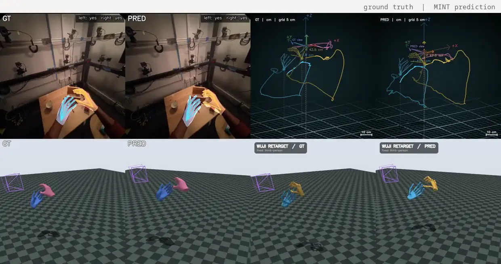
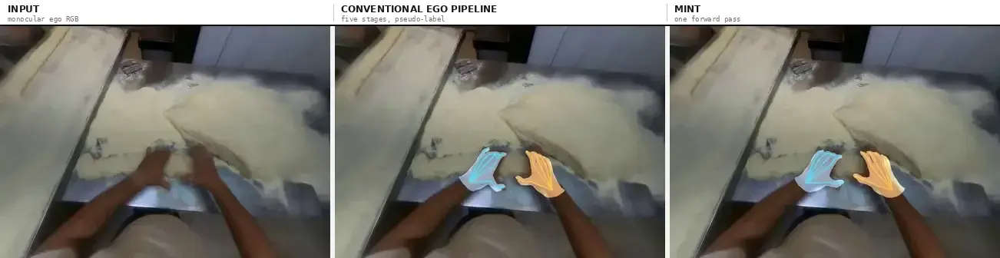
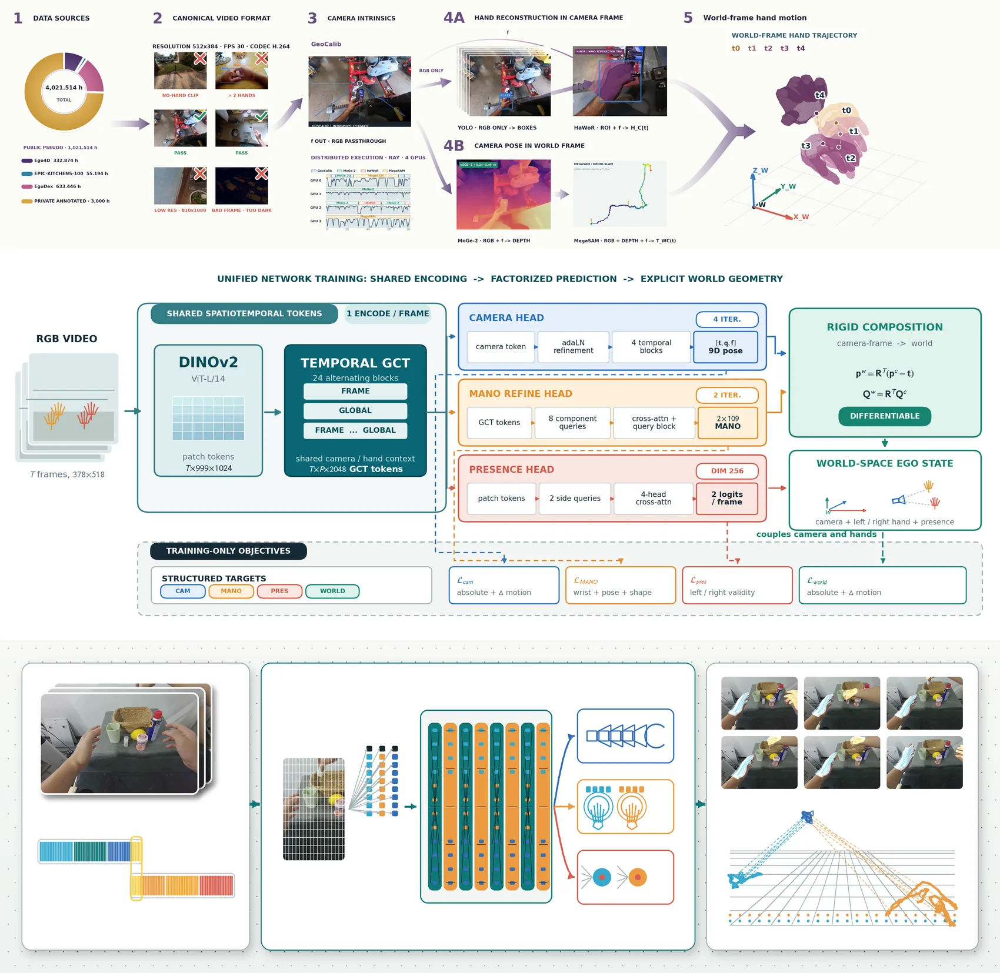
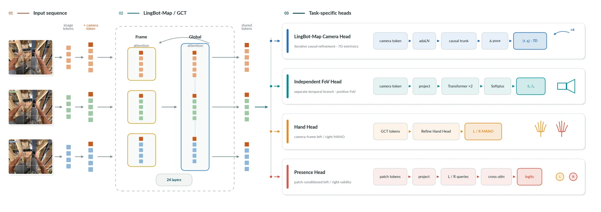
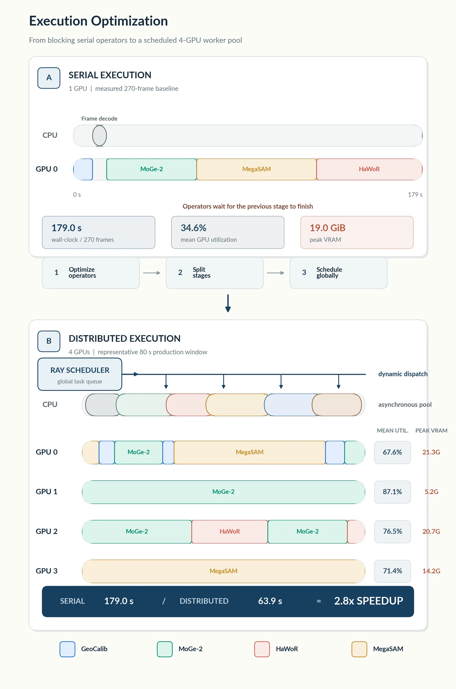
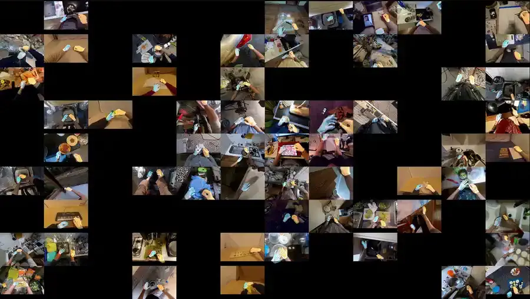

<div align="center">


<h1>MINT: Minting a Unified Model for World-Space Camera and Hand Motion<br>from Scalable Egocentric Pipeline Supervision</h1>

Zijie Zhu<sup>1,3,4</sup> &nbsp;·&nbsp; Weiren Cai<sup>3</sup> &nbsp;·&nbsp; Yizhou Wang<sup>1,3</sup> &nbsp;·&nbsp; Zhenjie Yang<sup>4</sup> &nbsp;·&nbsp; Jiahao Chen<sup>3,\*</sup> &nbsp;·&nbsp; Guanqi He<sup>2,3,\*</sup>

<sub><sup>1</sup>ShanghaiTech University &nbsp;&nbsp;<sup>2</sup>Tsinghua University &nbsp;&nbsp;<sup>3</sup>Wuji Technology &nbsp;&nbsp;<sup>4</sup>The University of Hong Kong &nbsp;&nbsp;<sup>\*</sup>Corresponding authors</sub>

[](#-citation)
[](https://huggingface.co/ZZJAsher/mint_v1)
[](https://huggingface.co/datasets/ZZJAsher/wuji_ego_mint)
[](https://www.modelscope.cn/models/AsherZhu/mint_v1)
[](LICENSE)
[](environments/mint-inference.yml)
[](#-quick-start-web-viewer)

[中文说明](README_ZH.md)

</div>

<!--
  FULL FILM (1 min 41 s). GitHub renders an inline player only for
  github.com/user-attachments URLs, and those can only be minted through the
  browser: open any issue or PR comment box in this repository, drag the MP4
  into it, copy the generated https://github.com/user-attachments/assets/...
  link, and paste it on its own line right here. Do not commit the MP4 — a
  <video> tag pointing at a file in the repository is stripped by GitHub's
  markdown sanitizer and renders as nothing.
-->



<div align="center"><sub>One monocular egocentric clip from <b>HOT3D</b>, which is held out completely. Left of each pair is device ground truth, right is MINT's prediction: ego-view MANO, world-space camera and two-hand trajectory, and the same trajectory retargeted to the Wuji hand in MuJoCo. Single forward pass, no per-sequence optimisation, no test-time tuning.</sub></div>

---

### 🤲 Meet MINT — world-space camera and bimanual motion, from one RGB video, in one forward pass

Activity understanding, robot imitation and AR all want the same thing: **where the wearer went and what both hands did, in world coordinates.** Today that state is recovered by chaining calibration → monocular depth → SLAM → hand reconstruction → trajectory cleanup. MINT replaces the chain at deployment time.

- **One unified model, not a five-stage chain.** A shared spatiotemporal representation feeds a camera-extrinsics head, an independent field-of-view head, a camera-frame MANO head and a per-frame hand-presence head; explicit differentiable rigid composition turns them into world-space hand motion. No depth map, no point cloud, no dense 3D intermediate at inference.
- **Structured pipeline amortization.** The multi-stage pipeline is kept — offline, as a supervision generator — and one model is trained on its final structured state. Not logit distillation: the student learns the structured camera–hand state of an entire non-end-to-end system.
- **Open end to end.** Model weights, training and inference code, the EgoPipeline labeling system, and a filtered **1,021-hour** structured egocentric dataset — with the release's own limits written down rather than left out.



<div align="center"><sub>Same frames, same overlay renderer. Left: the input. Middle: the conventional five-stage route, whose output is <b>pseudo-label, not ground truth</b>. Right: MINT, one forward pass. A qualitative example, selected by a measured overlay gap rather than by hand — see <a href="assets/readme/SOURCES.md">assets/readme/SOURCES.md</a>. Accuracy claims live in <a href="#-what-mint-is-measured-on">Benchmark</a>, never in a picture.</sub></div>

---

## 📑 Table of Contents

<details>
<summary>Click to expand</summary>

- [📰 News](#-news)
- [📋 Release status](#-release-status)
- [🚀 Quick Start: Web Viewer](#-quick-start-web-viewer)
  - [Model and asset locations](#model-and-asset-locations)
  - [Using the Viewer](#using-the-viewer)
- [🧠 How MINT works](#-how-mint-works)
  - [Model at a glance](#model-at-a-glance)
  - [Where the supervision comes from](#where-the-supervision-comes-from)
  - [Why one model instead of the chain](#why-one-model-instead-of-the-chain)
- [📊 What MINT is measured on](#-what-mint-is-measured-on)
- [📦 What is included](#-what-is-included)
- [🏋️ Training and optional pipeline reconstruction](#️-training-and-optional-pipeline-reconstruction)
- [🗂️ Public Ego pretraining data](#️-public-ego-pretraining-data)
- [🔐 LeRobot sample and privacy](#-lerobot-sample-and-privacy)
- [⚠️ Known limits](#️-known-limits)
- [🧾 Repository layout](#-repository-layout)
- [📚 Documentation](#-documentation)
- [✨ Acknowledgements](#-acknowledgements)
- [📜 License](#-license)
- [📖 Citation](#-citation)
- [📮 Contact](#-contact)

</details>

---

## 📰 News

- **2026-08-19** — Prediction labels unified across every Viewer visualization, so GT/prediction panels can no longer be confused with one another.
- **2026-08-18** — Viewer rendering refined and UKF smoothing controls exposed in the panel.
- **2026-08-16** — Benchmark panel published inside the Viewer, Wuji hand retargeting shipped (`eval/simulate/wuji-retargeting`), and the approved two-episode Hot3D LeRobot v3 sample bundled.
- **2026-08-15** — First public release: inference and training code, the checkpoint download workflow, and the 1,021-hour structured dataset on Hugging Face and ModelScope.

## 📋 Release status

| | Item | Where |
| :-- | :-- | :-- |
| ✅ | MINT checkpoint, 1.131 B parameters | [Hugging Face](https://huggingface.co/ZZJAsher/mint_v1) · [ModelScope](https://www.modelscope.cn/models/AsherZhu/mint_v1) |
| ✅ | Inference, Web Viewer, training code | this repository |
| ✅ | 1,021-hour structured egocentric dataset (non-video portion) | [Hugging Face](https://huggingface.co/datasets/ZZJAsher/wuji_ego_mint) · [ModelScope](https://www.modelscope.cn/datasets/AsherZhu/wuji_ego_mint) |
| ✅ | Benchmark implementation and CLI, integrated into the Viewer | `eval/model_effect/benchmark/` |
| ✅ | EgoPipeline orchestration, cleaning and LeRobot export reference | `ray_pipeline/` |
| ✅ | Wuji hand URDF/MJCF/STL and retargeting | `eval/simulate/wuji-retargeting/` |
| ⏳ | Zero-shot HOT3D / ARCTIC result tables | published with the paper; **no numbers are quoted here before then** |
| ⏳ | Scale-corrected camera trajectories for the released dataset | see [Known limits](#️-known-limits) |
| ❌ | License-restricted pipeline adaptations (adapted HaWoR source, weights, MANO) | cannot be redistributed; see [`THIRD_PARTY_NOTICES.md`](THIRD_PARTY_NOTICES.md) |

## 🚀 Quick Start: Web Viewer

The Web Viewer is the primary MINT entry point. It lets you select a checkpoint, load the MINT model, run inference on a LeRobot episode or an egocentric MP4 video, and inspect GT/prediction overlays, camera trajectories, hand motion, frame metrics, and benchmark results in one interface.

> **Hardware requirement: MINT model inference requires an NVIDIA GPU with at least 24 GB of VRAM.**

Install the inference environment and download the public MINT model. The Viewer also requires the separately licensed MANO hand models. Create an account on the [official MANO website](https://mano.is.tue.mpg.de/), accept the MANO license, and download the MANO release before running the asset check below.

```bash
git clone https://github.com/wuji-technology/wuji-ego-mint.git
cd wuji-ego-mint
bash scripts/create_env.sh inference
conda activate mint-inference
bash scripts/download_assets.sh

# Copy the MANO files from the downloaded release into the project.
mkdir -p assets/mano/mano_right assets/mano/mano_left
cp /path/to/MANO_RIGHT.pkl assets/mano/mano_right/MANO_RIGHT.pkl
cp /path/to/MANO_LEFT.pkl assets/mano/mano_left/MANO_LEFT.pkl

python -m mint doctor --profile inference
python -m mint viewer
```

### Model and asset locations

Place the models and assets used by Quick Start at the paths below. `scripts/download_assets.sh` downloads the public MINT checkpoint automatically; MANO must be downloaded from its official website and copied manually.

| Model or asset | Download source | Path in this repository | Notes |
| --- | --- | --- | --- |
| MINT checkpoint | [ModelScope](https://www.modelscope.cn/models/AsherZhu/mint_v1) or [Hugging Face](https://huggingface.co/ZZJAsher/mint_v1) | `checkpoints/model.safetensors` | The download script places and verifies it automatically; use the same path for a manual download. |
| MANO left- and right-hand models | [MANO website](https://mano.is.tue.mpg.de/) | `assets/mano/mano_right/MANO_RIGHT.pkl`<br>`assets/mano/mano_left/MANO_LEFT.pkl` | Registration and acceptance of the MANO License are required. |
| LingBot-Map pretrained backbone | [LingBot-Map](https://github.com/robbyant/lingbot-map) | `assets/models/lingbot-map.pt` | Optional; download only when required by the selected configuration. |
| Wuji Hand URDF, MJCF, and STL | Included in this repository | `eval/simulate/wuji-retargeting/wuji_retargeting/wuji-description/hand/body/` | No additional download is required. |

To reconstruct the Ego data-production pipeline, download the required weights under the terms of each upstream project and place them at these fixed paths:

| Data-pipeline asset | Path in this repository |
| --- | --- |
| GeoCalib weights | `model/geocalib/pinhole.tar` |
| MoGe weights | `model/moge2/model.pt` |
| Mega-SAM weights | `model/megasam/megasam_final.pth` |
| HaWoR weights | `model/hawor/hawor.ckpt` |
| HaWoR configuration | `model/hawor/model_config.yaml` |
| HaWoR detector | `model/hawor/detector.pt` |
| DROID-SLAM weights | `third_party/HaWoR/weights/external/droid.pth` |
| Metric3D weights | `third_party/HaWoR/thirdparty/Metric3D/weights/metric_depth_vit_large_800k.pth` |
| HaWoR right-hand MANO | `third_party/HaWoR/_DATA/data/mano/MANO_RIGHT.pkl` |
| HaWoR left-hand MANO | `third_party/HaWoR/_DATA/data_left/mano_left/MANO_LEFT.pkl` |

Benchmark data has no required in-repository location. At runtime, use `--data-root /path/to/benchmark-data` to select the downloaded and organized HOT3D, ARCTIC, or other benchmark datasets.

### Using the Viewer

The Viewer automatically opens `http://127.0.0.1:8011` in the default browser. Then:

1. In **Model and Sample**, keep `checkpoints/model.safetensors` or select another compatible checkpoint.
2. Click **Load Model** and wait until the model status is ready.
3. Select a LeRobot episode or an egocentric MP4 video, then choose the camera-inference, hand-window, and geometry settings.
4. Click **Start Inference**.
5. Inspect the synchronized GT/Pred 2D view, fixed-world and camera-frame 3D panels, per-frame values, losses, exports, and optional benchmark tools.


All visualization operations live in the Viewer panel — there is no separate command-line visualization step. See [Installation](docs/installation.md) for installation, CUDA, MANO, and offline deployment details.

## 🧠 How MINT works



<div align="center"><sub>Top band: how the supervision is produced and filtered. Middle: the unified network. Bottom: what one forward pass returns. In the source donut, only the public <b>1,021.514 h</b> of pipeline pseudo-labels is released — the human-annotated hours beside it are the Stage 2 calibration set and are not part of the release.</sub></div>

One shared encode per frame, four factorized heads, then explicit rigid composition into world space — so a world-space error updates the camera branch and the hand branch together.

### Model at a glance

| | |
| --- | --- |
| **Input** | monocular egocentric RGB, 378 × 518 frames, patch 14, 999 tokens per frame |
| **Backbone** | LingBot-Map / GCT — 24 alternating frame-wise / global attention pairs |
| **Clip** | T = 32 frames, re-anchored to the window's own first frame |
| **Parameters** | 1.131 B trainable |
| **Head 01** | camera extrinsics, 7-D `[t, q]`, iterative causal refinement, 4 steps |
| **Head 02** | field of view, `f_h, f_w`, independent temporal branch, Softplus |
| **Head 03** | camera-frame hand MANO, 218-D, left + right, component queries, 2 refinements |
| **Head 04** | per-frame hand presence, logits L / R, patch cross-attention |
| **Composition** | `x_c = R x_w + t`, `p_w = Rᵀ(p_c − t)`, `Q_w = Rᵀ Q_c` — explicit and differentiable |
| **At inference** | no depth map, no point cloud, no dense 3D intermediate |
| **Training** | Stage 1 pretrain on 1,021 h of pipeline supervision → Stage 2 calibrate on a small high-precision camera–hand set |



### Where the supervision comes from

**EgoPipeline** is our open-source implementation of the conventional multi-stage route, and it stays in the project as the *supervision generator*, not as the deployment path:

| Stage | Component | Produces |
| --- | --- | --- |
| 00 | preprocessing | validated metadata, one decode per segment, overlapping clips, short/dirty data dropped |
| 01 | GeoCalib | camera intrinsics |
| 02 | MoGe-2 | monocular depth |
| 03 | MegaSaM / DROID-SLAM | metric camera track |
| 04 | HaWoR | camera-frame MANO |
| 05 | cleanup | outlier rejection, gap interpolation, temporal filters |

Its output is **pseudo-label, not ground truth** — that distinction is load-bearing everywhere in this repository.

### Why one model instead of the chain



<div align="center"><sub>This figure is <b>internal to the pipeline</b>: rewriting its serial 1-GPU execution as a scheduled 4-GPU worker pool takes 179.0 s down to 63.9 s per 270 frames, a <b>2.8×</b> speedup. That optimised version is the baseline the <b>5.0×</b> above is measured against — the two numbers are different comparisons and do not multiply.</sub></div>

A staged chain has structural costs that better engineering does not remove: each stage re-encodes the same video, camera and hands meet only in post-processing, every stage is capped by the one before it, and one operator regressing regresses the whole record. Under whole-process accounting — raw input video in, stored unified structured state out, identical inputs and hardware — the unified model reaches **5.0× the effective data-production throughput of EgoPipeline**. That figure is end-to-end data production, *not* model forward time, and the baseline is EgoPipeline already distributed-optimised with Ray multi-GPU operators, persistent workers and asynchronous CPU stages.



<div align="center"><sub>108 MINT renders from the three released corpora, playing at once. The full release is 1,021.514 h · 560,649 episodes · 110,323,558 frames of structured supervision.</sub></div>

## 📊 What MINT is measured on

**No accuracy numbers appear in this README.** The zero-shot tables are published with the paper; until then, what we can state precisely is the protocol.

- **Held out completely.** HOT3D and ARCTIC images, pipeline labels and ground truth are excluded from training, high-precision calibration, hyper-parameter and loss-weight selection, and checkpoint selection. No test-time tuning. Only models satisfying this condition may enter the zero-shot tables.
- **Split hygiene.** All official splits are made by original video ID before clipping, with additional participant-level separation wherever participant IDs exist.
- **Same inputs for everyone.** All learned methods share inputs, evaluation preprocessing and a fixed evaluation manifest; sequence-level failures are counted consistently. Methods that cannot output both camera and hands receive N/A — no other method's output is ever substituted.
- **One asymmetry, stated.** Where a compared method reports results under its own HOT3D/ARCTIC training and evaluation settings rather than zero-shot, that difference is reported explicitly instead of being averaged away.

**Benchmark integrity statement.** We commit that every metric reported by this project is an authentic result produced under the stated evaluation protocol; we do not alter the original numeric results. To reproduce a baseline or another method's exact values, use that method's official repository and environment. The metric definitions, alignment rules, aggregation logic, and reporting code used by MINT are available in `eval/model_effect/benchmark/` for inspection.

The complete implementation and tests live in `eval/model_effect/benchmark/` and are integrated into the Viewer's Benchmark panel. Before use, download HOT3D and ARCTIC, organize the benchmark data as required by each adapter, and install the optional runtime. The CLI remains available:

```bash
python eval/model_effect/benchmark/run.py \
  --ckpt /path/to/checkpoint \
  --config configs/training/mint_step2.yaml \
  --data-root /path/to/benchmark-data
```

Set `CAMERA_TRAJECTORY_ROOT` for camera-trajectory exports when needed. Aliyun defaults are placeholders; users must configure the workspace, resource, image, CPFS, credentials, and environment. This project does not provision or maintain benchmark environments.

## 📦 What is included

| Area | Entry point | Purpose |
| --- | --- | --- |
| Infer and view | `python -m mint viewer` | Web UI for LeRobot GT, predictions, 2D/3D trajectories, and frame metrics. |
| Train | `python -m mint train` | Train the camera-and-hand MINT model with Accelerate/DDP. |
| Benchmark | `python eval/model_effect/benchmark/run.py` | Open benchmark CLI with user-provided data and environment. |
| Audit | `python -m mint doctor` | Verify the environment, optional backends, assets, and GPU runtime. |
| Pipeline reference | `ray_pipeline/` | Reuse the open Ray orchestration, interfaces, cleaning, and LeRobot export code after integrating the required upstream backends locally. |

## 🏋️ Training and optional pipeline reconstruction

Training or local pipeline-development work requires the full environment:

```bash
bash scripts/create_env.sh full
conda activate mint
python -m mint doctor --profile full
```

The public release uses the Viewer as the unified entry point for MINT inference, visualization, and artifact export. This project publishes only code that third-party licenses permit us to distribute; license-restricted adaptations and internal integrations are excluded, so **this repository does not contain the complete production data pipeline.**

GeoCalib, MoGe, and Mega-SAM source snapshots are distributed under `third_party/`, but some production adaptations cannot be published under their upstream license terms. In particular, the locally adapted HaWoR source is Git-ignored because CC BY-NC-ND prohibits redistribution of modifications. Weights, MANO files, and other separately licensed assets are also excluded.

If you need to reconstruct the data-generation pipeline, first read [`THIRD_PARTY_NOTICES.md`](THIRD_PARTY_NOTICES.md), obtain and install every required upstream library and asset under its own terms, and implement the necessary compatibility adapters locally. The open code in `ray_pipeline/` documents the orchestration, interfaces, data flow, cleaning, manifests, and LeRobot export contracts. An AI coding assistant may help reconcile upstream API differences, but the resulting integration remains the user's responsibility and must comply with all licenses. Only after completing that local integration should the data-profile doctor and `python -m mint pipeline` be treated as usable entry points.

The public release provides an implementation reference, not a one-command reproduction of the production data generator. Use MINT directly for inference; for pipeline reconstruction, supply the licensed upstream code and assets and complete the local integration described in [Data pipeline](docs/data-pipeline.md).

### Train

Only the two configurations associated with the selected checkpoints are kept. `step_00019000` is Stage 1; `step_00004500` is the Stage 2 WorldEngine camera-only adaptation initialized from Stage 1 and is the final fine-tuned checkpoint released publicly:

```bash
python -m mint train --config configs/training/mint_step1.yaml

python -m mint train --config configs/training/mint_step2.yaml
```

The Stage 2 `train.init_from` points to the Stage 1 `step_00019000/model.safetensors`.

`mint train` consumes a compatible, separately prepared LeRobot dataset and writes training checkpoints. After training, select the new checkpoint directly in the Viewer panel for interactive inspection.

## 🗂️ Public Ego pretraining data

We provide the non-video portions of the `ego4d`, `egodex`, and `epickitchen` data processed by this repository's Ego data-production pipeline:

- [Hugging Face: ZZJAsher/wuji_ego_mint](https://huggingface.co/datasets/ZZJAsher/wuji_ego_mint)
- [ModelScope: AsherZhu/wuji_ego_mint](https://www.modelscope.cn/datasets/AsherZhu/wuji_ego_mint)

| | |
| --- | --- |
| Structured supervision | camera trajectory, two-hand MANO, per-frame presence, world-space motion |
| Kept after filtering and trajectory cleaning | **1,021.514 h** · 560,649 episodes · 110,323,558 frames |
| Sources | Ego4D 332.874 h · EPIC-KITCHENS-100 55.194 h · EgoDex 633.446 h |
| Yield | 59.1 % of 1,729 raw hours |

> **Important: the camera trajectories in this data were generated by this repository's Ego data pipeline and currently exhibit obvious scale enlargement. We recommend using the data only to pretrain this project's Ego hand reconstruction model. Do not use it for real-scale evaluation, precise camera trajectory evaluation, or as real-scale ground truth.**

The public dataset does not include `.mp4` videos. The source videos belong to Ego4D, EgoDex, and EPIC-KITCHENS and are governed by their respective dataset licenses and access terms, so this project cannot redistribute them. Users who need the videos must apply for and download them through the corresponding official dataset channels and verify their own usage and redistribution rights.

## 🔐 LeRobot sample and privacy

`data/samples/lerobot_v3/` is the only bundled sample: eight contrasting centered 15-second clips selected from the sorted Hot3D sequence exports, forming a valid **8-episode, 3,600-frame** LeRobot v3 dataset — 512 × 512 at 30 fps, 21 MB on disk — with synchronized H.264 video, Hot3D camera and two-hand labels, task text, and episode metadata. Participant IDs and original sequence names are not stored; only anonymous source collection indices and centered frame ranges, in `lerobot_v3/sample_manifest.json`.

Rebuild it from local full exports with:

```bash
python scripts/build_sample_lerobot.py \
  --source-root /path/to/hot3d_to_lerobot \
  --output data/samples/lerobot_v3
```

Dataset access does not itself grant redistribution rights. The publisher must still confirm licensing, participant consent, and frame-by-frame privacy review. See [Privacy](docs/privacy.md) for details.

## ⚠️ Known limits

We would rather you read these here than discover them later:

- **EgoPipeline output is pseudo-label, not ground truth.** Every accuracy claim about MINT is measured on held-out real ground truth instead.
- **The released camera trajectories still show scale enlargement** (see the warning above). Use them for pretraining, not for metric evaluation.
- **32-frame clip training does not by itself prove long-video consistency.** Long-sequence behaviour is reported separately, not extrapolated from clip-level accuracy.
- **Presence labels inherit a fixed detector threshold.** Shared temporal features let the student correct isolated teacher misses and false positives, and that is audited against blind-reviewed presence rather than against the pseudo-labels it was trained on.
- **This repository is not the complete production data pipeline.** License-restricted adaptations are excluded by design; see [Training and optional pipeline reconstruction](#️-training-and-optional-pipeline-reconstruction).

## 🧾 Repository layout

```text
mint/
|-- configs/          Two-stage training recipes and inference settings
|-- data/samples/     Approved Hot3D LeRobot v3 sample
|-- eval/model_effect Original visualization, inference adapters, and benchmarks
|-- docs/             Architecture and operational guides
|-- environments/     Full and inference-only dependency specifications
|-- mint/             CLI, inference engine, renderer, and web viewer
|-- model_train/      Training engine, model, losses, and LeRobot loader
|-- ray_pipeline/     Ray scheduling, actors, model backends, trajectory cleanup, manifests, and export
|-- scripts/          Reproducible setup, asset, privacy, and sample tools
`-- third_party/      Redistributable source snapshot; adapted HaWoR is local-only, assets excluded
```

## 📚 Documentation

| | |
| --- | --- |
| [Architecture](docs/architecture.md) | how the model and the repository fit together |
| [Installation](docs/installation.md) | profiles, CUDA, MANO, offline deployment |
| [Data pipeline](docs/data-pipeline.md) | EgoPipeline stages and local reconstruction |
| [Training](docs/training.md) | the two-stage recipe |
| [LeRobot training data format](docs/lerobot-training-data.md) | what a compatible dataset must contain |
| [Inference and viewer](docs/inference.md) | Viewer panels, exports, benchmark tools |
| [Privacy and release checklist](docs/privacy.md) | consent, review, redistribution |
| [Security policy](SECURITY.md) | how to report a vulnerability |
| [Third-party notices](THIRD_PARTY_NOTICES.md) | upstream licenses — read before distributing |
| [README art provenance](assets/readme/SOURCES.md) | which clip and which figure every image above comes from |

## ✨ Acknowledgements

MINT is made possible by the following research projects, models, and datasets.

- **[VITRA](https://microsoft.github.io/VITRA/)** — MINT's data-processing architecture, egocentric reconstruction workflow, world-space camera/hand annotations, and LeRobot conversion conventions evolved from the VITRA and VITRA-1M data engine.
- **[LingBot-Map](https://github.com/robbyant/lingbot-map)** — provides the core model architecture and the upstream source adapted for MINT camera-and-hand training and inference.
- **[HaWoR](https://github.com/ThunderVVV/HaWoR)** — provides monocular hand motion reconstruction, MANO estimation, tracking, and world-space hand-processing components used by the optional data pipeline. Its use remains subject to the upstream non-commercial, no-derivatives license.
- **Camera, depth, and tracking research** — [GeoCalib](https://github.com/cvg/GeoCalib), [MoGe](https://github.com/microsoft/MoGe), [Mega-SAM](https://github.com/mega-sam/mega-sam), [DROID-SLAM](https://github.com/princeton-vl/DROID-SLAM), [UniDepth](https://github.com/lpiccinelli-eth/UniDepth), [Metric3D](https://github.com/YvanYin/Metric3D), [DeepCalib](https://github.com/alexvbogdan/DeepCalib), [DINOv2](https://github.com/facebookresearch/dinov2), [VGGT](https://github.com/facebookresearch/vggt), InfiniteVGGT, and [PyTorch3D](https://github.com/facebookresearch/pytorch3d).
- **Hand models, simulation, and retargeting** — [MANO](https://mano.is.tue.mpg.de), [SMPL-X](https://smpl-x.is.tue.mpg.de), [MuJoCo](https://mujoco.org), and the Wuji hand description and retargeting components used by the optional Viewer panels.
- **Datasets and benchmarks** — [HOT3D](https://github.com/facebookresearch/hot3d), [ARCTIC](https://arctic.is.tue.mpg.de), [Ego4D](https://ego4d-data.org), [EPIC-KITCHENS](https://epic-kitchens.github.io), and [EgoDex](https://github.com/apple/ml-egodex). Dataset access and redistribution remain governed by each dataset's own terms.

We thank all upstream authors and maintainers. This acknowledgement does not replace their citation or license requirements; see [Third-party notices](THIRD_PARTY_NOTICES.md) before use or distribution.

## 📜 License

wuji-ego-mint's original code is released under the MIT License. Upstream models, datasets, MANO assets, vendored LingBot-Map files, and optional research backends retain their own licenses. Review [Third-party notices](THIRD_PARTY_NOTICES.md) before distribution.

## 📖 Citation

The paper is under review; this entry will be replaced with the published reference.

```bibtex
@misc{zhu2026mint,
  title  = {MINT: Minting a Unified Model for World-Space Camera and Hand Motion
            from Scalable Egocentric Pipeline Supervision},
  author = {Zhu, Zijie and Cai, Weiren and Wang, Yizhou and Yang, Zhenjie and
            Chen, Jiahao and He, Guanqi},
  year   = {2026},
  note   = {Manuscript under review}
}
```

## 📮 Contact

If you encounter any issues with installation, data generation, model training, inference, or the Viewer, please contact Zijie Zhu. WeChat: `z3132544408`; email: `3132544408@qq.com`.
