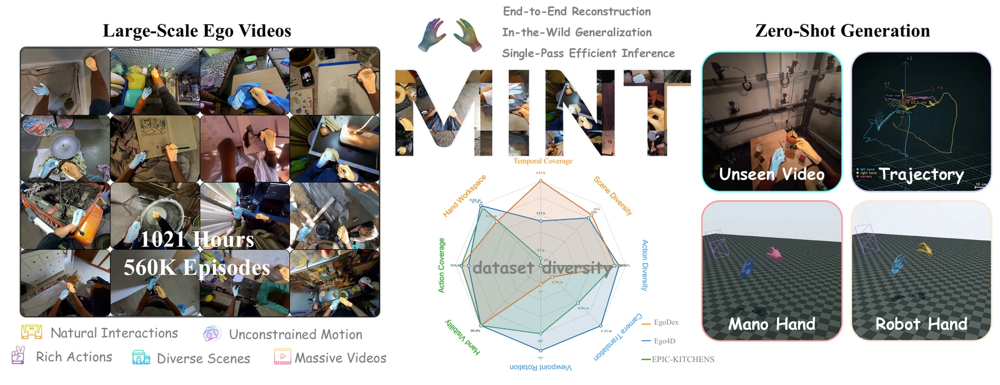
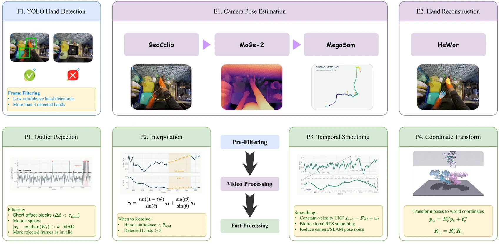

<div align="center">

<!--
  完整宣传片（1 分 41 秒）—— 宣传片放在 README 最上面，位于封面视频墙之前。
  源文件：宣传片工程里的 out/MINT_full_en.mp4（1920 × 1080，72 MB，特意不入库）。
  GitHub 只为 github.com/user-attachments 链接渲染内嵌播放器，而这种链接只能通过
  浏览器上传获得：在本仓库任意 issue / PR 的评论框里把 MP4 拖进去，复制生成的
  https://github.com/user-attachments/assets/... 链接，单独一行粘贴到这段注释
  下面。不要把 MP4 提交进仓库 —— 指向仓库文件的 <video> 标签会被 GitHub 的
  markdown 过滤器整段删掉，页面上什么都不会显示。
-->


<h2>MINT：用可扩展的第一视角管线监督<br>训练世界坐标系相机与手部运动的统一模型</h2>

Zijie Zhu<sup>1,3,4</sup> &nbsp;·&nbsp; Weiren Cai<sup>3</sup> &nbsp;·&nbsp; Yizhou Wang<sup>1,3</sup> &nbsp;·&nbsp; Zhenjie Yang<sup>4</sup> &nbsp;·&nbsp; Yide Liu<sup>3,5</sup> &nbsp;·&nbsp; Jiahao Chen<sup>3,\*</sup> &nbsp;·&nbsp; Guanqi He<sup>2,3,\*</sup>

<sub><sup>1</sup>上海科技大学 &nbsp;&nbsp;<sup>2</sup>清华大学 &nbsp;&nbsp;<sup>3</sup>舞肌科技 &nbsp;&nbsp;<sup>4</sup>香港大学 &nbsp;&nbsp;<sup>5</sup>浙江大学 &nbsp;&nbsp;<sup>\*</sup>通讯作者</sub>

<!-- TODO：arXiv 链接上线后填进下面这个 badge。 -->
[]()
[](https://huggingface.co/ZZJAsher/mint_v1)
[](https://www.modelscope.cn/models/AsherZhu/mint_v1)
[](https://huggingface.co/datasets/ZZJAsher/wuji_ego_mint)
[](https://www.modelscope.cn/datasets/AsherZhu/wuji_ego_mint)
[](LICENSE)

[English](README.md)

</div>


---

### 🤲 认识 MINT —— 让世界坐标系下的第一视角手部数据，人人都产得起

戴相机的人在屋子里怎么走动、两只手到过哪些位置做了什么 —— 要的是它们在真实空间里的位置，不是画面里的像素位置。今天要拿到它，得买带 SLAM 的采集设备，或者把相机标定 → 单目深度 → SLAM → 手部重建 → 轨迹清理串成一条链：每一级一份权重、一类失败、一条许可证限制。于是产出这类数据的能力集中在少数跑得起这条链的实验室手里，而具身智能最缺的恰恰是海量真实人手数据。

MINT 把这条链换掉：**一段普通 RGB 视频、一张 24 GB 显存的显卡、一次前向**，直接得到世界坐标系下的相机与双手运动。有视频，就能产数据。

- **一个统一模型，而不是五级串行链。** 共享的时空表征同时驱动四个头 —— 相机外参、视场角、相机坐标系 MANO、逐帧手部存在性 —— 再由显式可微的刚体组合得到世界坐标系手部运动。推理时不产生任何稠密 3D 中间结果。
- **结构化管线摊销（structured pipeline amortization）。** 多级管线留在线下，只作监督信号的生成器，再用一个模型去学它最终那份结构化状态 —— 这不是 logit 蒸馏，学的是一整套非端到端系统的相机–手部状态。跑这套系统的代价由我们付一次，而不是每个使用者各付一次。
- **端到端开源。** 模型权重、训练与推理代码、EgoPipeline 标注系统，以及经过严格过滤的 **1,021 小时**结构化第一视角数据集 —— 可复现、可审查、可以自己接着改，而不是一个只能调用的服务。


<div align="center"><sub>同一批帧，同一套叠加渲染。左：输入。中：传统 ego 管线，其输出是<b>伪标签，不是真值</b>。右：MINT，一次前向。</sub></div>

---

## 📑 目录

<details open>
<summary>点击收起</summary>

- [📋 发布状态](#-发布状态)
- [🚀 快速开始：Web Viewer](#-快速开始web-viewer)
- [🧠 MINT 是怎么工作的](#-mint-是怎么工作的)
- [📊 评测口径](#-评测口径)
- [📦 功能范围](#-功能范围)
- [🏋️ 模型训练与可选管线复现](#️-模型训练与可选管线复现)
- [🗂️ 公开 Ego 预训练数据](#️-公开-ego-预训练数据)
- [🔐 LeRobot 样例与隐私](#-lerobot-样例与隐私)
- [⚠️ 已知局限](#️-已知局限)
- [🧾 仓库结构](#-仓库结构)
- [📚 文档](#-文档)
- [✨ 致谢](#-致谢)
- [📜 许可证](#-许可证)
- [📖 引用](#-引用)

</details>

---

## 📋 发布状态

| | 内容 | 位置 |
| :-- | :-- | :-- |
| ✅ | MINT checkpoint，11.31 亿参数 | [Hugging Face](https://huggingface.co/ZZJAsher/mint_v1) · [ModelScope](https://www.modelscope.cn/models/AsherZhu/mint_v1) |
| ✅ | 推理、Web Viewer、训练代码 | 本仓库 |
| ✅ | 1,021 小时结构化第一视角数据集（非视频部分） | [Hugging Face](https://huggingface.co/datasets/ZZJAsher/wuji_ego_mint) · [ModelScope](https://www.modelscope.cn/datasets/AsherZhu/wuji_ego_mint) |
| ✅ | Benchmark 实现与 CLI，已接入 Viewer | `eval/model_effect/benchmark/` |
| ✅ | EgoPipeline 调度、清理与 LeRobot 导出参考实现 | `ego_pipeline/` |
| ✅ | 视频规格化与手部过滤脚本 | [`ego_pipeline/preprocessing/`](ego_pipeline/preprocessing/) |
| ✅ | Wuji 灵巧手 URDF/MJCF/STL 与重定向 | `eval/simulate/wuji-retargeting/` |
| ✅ | HOT3D / ARCTIC 零样本结果表（论文 Table 1） | [相机系下的双手重建](#相机系下的双手重建) |
| ⏳ | 相机轨迹的尺度校正版本 —— 已发布数据集中的相机轨迹存在尺度放大 | 现有轨迹可用于预训练，不可用于米制评测，成因见[公开 Ego 预训练数据](#️-公开-ego-预训练数据) |
| ❌ | 受许可证限制的管线适配（改动过的 HaWoR 源码、权重、MANO） | 不能再分发，见 [`THIRD_PARTY_NOTICES.md`](THIRD_PARTY_NOTICES.md) |

## 🚀 快速开始：Web Viewer

Web Viewer 是 MINT 的主要入口，可以在一个界面中选择 checkpoint、加载 MINT 模型、对 LeRobot episode 或 Ego 视角的 MP4 视频运行推理，并查看 GT/预测叠加、相机轨迹、手部运动、逐帧指标和 benchmark 结果。

> **硬件要求：MINT 模型推理需要 NVIDIA GPU，显存至少为 24 GB。**

安装推理环境、下载公开 MINT 模型并准备 MANO 手部模型，然后启动 Viewer。MANO 需要在[官方网站](https://mano.is.tue.mpg.de/)注册账号、接受许可证并手动下载，本项目不能代为下载或分发：

```bash
git clone https://github.com/wuji-technology/wuji-ego-mint.git
cd wuji-ego-mint
bash scripts/create_env.sh inference
conda activate mint-inference
bash scripts/download_assets.sh

# 从下载并解压后的 MANO 文件中复制左右手模型。
mkdir -p assets/mano/mano_right assets/mano/mano_left
cp /path/to/MANO_RIGHT.pkl assets/mano/mano_right/MANO_RIGHT.pkl
cp /path/to/MANO_LEFT.pkl assets/mano/mano_left/MANO_LEFT.pkl

python -m mint doctor --profile inference
python -m mint viewer
```

### 模型与资产放置路径

Quick Start 使用的模型与资产请按下表放置。`scripts/download_assets.sh` 会自动下载公开 MINT checkpoint；MANO 需由使用者从官方网站下载后手动复制。

| 模型或资产 | 下载来源 | 仓库内放置路径 | 说明 |
| --- | --- | --- | --- |
| MINT checkpoint | [ModelScope](https://www.modelscope.cn/models/AsherZhu/mint_v1) 或 [Hugging Face](https://huggingface.co/ZZJAsher/mint_v1) | `checkpoints/model.safetensors` | 下载脚本会自动放置并校验；手动下载时也应使用该路径。 |
| MANO 左右手模型 | [MANO 官网](https://mano.is.tue.mpg.de/) | `assets/mano/mano_right/MANO_RIGHT.pkl`<br>`assets/mano/mano_left/MANO_LEFT.pkl` | 需要注册并接受 MANO License。 |
| LingBot-Map 预训练骨干 | [LingBot-Map](https://github.com/robbyant/lingbot-map) | `assets/models/lingbot-map.pt` | 可选资产，仅在对应配置需要时下载。 |
| Wuji Hand URDF、MJCF 和 STL | 已包含在本仓库 | `eval/simulate/wuji-retargeting/wuji_retargeting/wuji-description/hand/body/` | 无需额外下载。 |

### 使用 Viewer

Viewer 启动后会自动在默认浏览器打开 `http://127.0.0.1:8011`，然后依次操作：

1. 在 **模型与样本** 中保留 `checkpoints/model.safetensors`，或者选择其他兼容 checkpoint。
2. 点击 **加载模型**，等待模型状态变为就绪。
3. 选择 LeRobot episode 或 Ego 视角的 MP4 视频，并设置相机推理、手部拼窗和几何参数。
4. 点击 **开始推理**。
5. 查看同步的 GT/Pred 2D、固定世界和当前相机 3D、逐帧数值、loss、导出及可选 benchmark 工具。


**要测试自己的视频**，不需要改配置、也不需要走命令行：在 Viewer 右下方的输入目录里浏览到视频所在路径，点击选中即可。支持的格式为 `.mp4`、`.mov`、`.avi`、`.mkv`、`.webm`。裸视频没有真值，Viewer 会进入纯预测模式 —— GT 面板、GT/Pred 并排布局与 loss 读数都会隐藏，画面上的全部内容都是预测结果。

所有可视化操作都在 Viewer 面板中完成，不需要额外的命令行可视化步骤。安装、CUDA、MANO 与离线部署细节见 [安装指南](docs/installation.md)。

## 🧠 MINT 是怎么工作的



<div align="center"><sub>左侧：本次发布的监督数据 —— <b>1,021 小时</b>、<b>56 万</b> episode 的第一视角视频，以及它与 EgoDex、Ego4D、EPIC-KITCHENS 在多样性上的对比。右侧：一段未见过的视频单次前向通过 MINT 的结果 —— 世界坐标系相机与手部轨迹、MANO 手，以及重定向到机器人手的同一段运动。</sub></div>

每帧只编码一次，四个头分工预测，再用显式刚体变换组合到世界坐标系 —— 于是世界坐标系下的误差会同时更新相机分支和手部分支。

### 模型速览

| | |
| --- | --- |
| **输入** | 单目第一视角 RGB，378 × 518，patch 14，每帧 999 token |
| **骨干** | LingBot-Map / GCT —— 24 组帧内注意力与全局注意力交替 |
| **片段** | T = 32 帧，重新锚定到窗口自身的第一帧 |
| **参数量** | 11.31 亿（可训练） |
| **头 01** | 相机外参，7 维 `[t, q]`，因果迭代精化 4 步 |
| **头 02** | 视场角，`f_h, f_w`，独立时序分支 + Softplus |
| **头 03** | 相机坐标系手部 MANO，218 维，左右手，部件查询 + 2 次精化 |
| **头 04** | 逐帧手部存在性，左/右 logits，patch 交叉注意力 |
| **组合** | `x_c = R x_w + t`、`p_w = Rᵀ(p_c − t)`、`Q_w = Rᵀ Q_c` —— 显式且可微 |
| **推理时** | 不出深度图、不出点云、无稠密 3D 中间结果 |
| **训练** | Stage 1 在 1,021 小时管线监督上预训练 → Stage 2 用小规模高精度轨迹数据校正相机轨迹，几何编码器与手部、存在性、视场角模块保持冻结 |



<div align="center"><sub><b>EgoPipeline</b>，离线的监督信号生成器。上排：预过滤与各级估计器。下排：把各级原始输出整理成可用结构化状态的后处理。逐级说明见下方表格。</sub></div>

### 监督信号从哪里来

**EgoPipeline** 是我们对传统多级路线的开源实现。它在本项目里的角色是*监督信号生成器*，而不是部署路径：

| 阶段 | 组件 | 产出 |
| --- | --- | --- |
| 00 | [预处理与过滤](ego_pipeline/preprocessing/) | 规格化 fps/分辨率/时长；按手部检测切掉无手与多手区间；校验元数据、切分重叠片段 |
| 01 | GeoCalib | 相机内参 |
| 02 | MoGe-2 | 单目深度 |
| 03 | MegaSaM / DROID-SLAM | 米制相机轨迹 |
| 04 | HaWoR | 相机坐标系 MANO |
| 05 | 清理 | 剔除离群点、插补缺口、时序滤波 |

它的输出是**伪标签，不是真值** —— 这个区分在本仓库里处处生效。

### 为什么用一个模型替掉整条链


串行链有一些靠工程优化消不掉的结构性代价：每一级都要把同一段视频重新编码一次；相机和手部只在后处理里才相遇；每一级的上限都被它前面那一级锁死；任何一个算子退化，整条记录都会退化。

推理吞吐，在 **RTX 4090D** 上实测，512 × 384、30 fps，条件完全一致；时间是**稳态下的每帧边际成本**。加速比以 **VITRA** 为基准 —— 本项目的数据管线 **EgoPipeline** 就是在它的基础上优化来的。表里的三个方法是同一条路线上的三个点：VITRA 起步，EgoPipeline 是管线级优化，MINT 用一个模型替掉整条链。

<table>
<thead>
<tr>
  <th align="left">方法</th>
  <th align="right">时间 ↓<br><sub>ms/帧</sub></th>
  <th align="right">fps ↑</th>
  <th align="right">加速比 ↑<br><sub>相对 VITRA</sub></th>
</tr>
</thead>
<tbody>
<tr><th colspan="4" align="left">单卡</th></tr>
<tr><td align="left">VITRA</td><td align="right">1260.0</td><td align="right">0.8</td><td align="right">—</td></tr>
<tr><td align="left">MINT</td><td align="right"><b>72.4</b></td><td align="right"><b>13.8</b></td><td align="right"><b>17.4×</b></td></tr>
<tr><th colspan="4" align="left">四卡</th></tr>
<tr><td align="left">EgoPipeline</td><td align="right">83.4</td><td align="right">12.0</td><td align="right">3.4×</td></tr>
<tr><td align="left">MINT</td><td align="right"><b>22.7</b></td><td align="right"><b>44.1</b></td><td align="right"><b>12.5×</b></td></tr>
</tbody>
</table>

MINT 单卡快 **17.4 倍**（1260.0 → 72.4 ms/帧），四卡快 **12.5 倍**（283.3 → 22.7 ms/帧）。四卡这一组能看出增益来自哪里：管线级优化占 3.4×（283.3 → 83.4），换成统一模型再压到 22.7。四卡下只有 MINT 跑过了 30 fps 实时线（44.1 fps）。

EgoPipeline 自己也做过分布式优化（Ray 多卡算子、常驻 worker、异步 CPU 阶段）：串行单卡改成 4 卡调度的 worker 池，270 帧的墙钟时间从 179.0 秒降到 63.9 秒，管线内部 **2.8×**。那是含解码与落盘的整段墙钟，和上表的稳态边际成本不是一个口径，两个数字不能相乘。

## 📊 评测口径

### 相机系下的双手重建

**MINT 在两个 benchmark 上都是零样本** —— 训练时从没见过它们。ViDiHand（标 `*`）在这两个 benchmark 的大部分数据上训练过，所以它**只列作参考**，评判谁最好时不算它；加粗标的是其余各行中的最优值。`MINT + UKF` 是同一个模型，只是推理时打开了滤波，别的都没变。

<table>
<thead>
<tr>
  <th rowspan="2" align="left">方法</th>
  <th colspan="3" align="center">检测</th>
  <th colspan="2" align="center">3D 姿态</th>
  <th colspan="2" align="center">朝向与位置</th>
  <th colspan="1" align="center">时序</th>
</tr>
<tr>
  <th align="right">FAcc ↑</th>
  <th align="right">Recall ↑</th>
  <th align="right">F1 ↑</th>
  <th align="right">MPJPE-p ↓<br><sub>mm</sub></th>
  <th align="right">PA-MPJPE-p ↓<br><sub>mm</sub></th>
  <th align="right">GO-p ↓<br><sub>度</sub></th>
  <th align="right">CT-p ↓<br><sub>m</sub></th>
  <th align="right">Jitter ↓<br><sub>mm/frame²</sub></th>
</tr>
</thead>
<tbody>
<tr><th colspan="9" align="left">ARCTIC</th></tr>
<tr><td align="left">InterWild</td><td align="right">0.878</td><td align="right">0.943</td><td align="right">0.959</td><td align="right">30.82</td><td align="right">15.95</td><td align="right">25.39</td><td align="right">0.097</td><td align="right">46.58</td></tr>
<tr><td align="left">HaMeR</td><td align="right">0.875</td><td align="right">0.943</td><td align="right">0.957</td><td align="right">29.20</td><td align="right">14.60</td><td align="right">24.91</td><td align="right">0.095</td><td align="right">18.28</td></tr>
<tr><td align="left">Hamba</td><td align="right">0.833</td><td align="right">0.912</td><td align="right">0.941</td><td align="right">31.23</td><td align="right">17.17</td><td align="right">27.82</td><td align="right">0.110</td><td align="right">15.36</td></tr>
<tr><td align="left">WildHands</td><td align="right">0.879</td><td align="right">0.946</td><td align="right">0.960</td><td align="right">25.70</td><td align="right">13.94</td><td align="right">22.32</td><td align="right"><b>0.058</b></td><td align="right">12.97</td></tr>
<tr><td align="left">OmniHands</td><td align="right">0.866</td><td align="right">0.949</td><td align="right">0.954</td><td align="right">29.67</td><td align="right">14.20</td><td align="right">24.58</td><td align="right">0.087</td><td align="right">45.31</td></tr>
<tr><td align="left">WiLoR</td><td align="right"><b>0.919</b></td><td align="right">0.951</td><td align="right">0.974</td><td align="right"><b>22.01</b></td><td align="right"><b>11.87</b></td><td align="right"><b>17.36</b></td><td align="right">0.075</td><td align="right">24.09</td></tr>
<tr><td align="left">Dyn-HaMR</td><td align="right">0.842</td><td align="right">0.918</td><td align="right">0.951</td><td align="right">27.90</td><td align="right">17.02</td><td align="right">25.95</td><td align="right">0.121</td><td align="right">12.84</td></tr>
<tr><td align="left">HaWoR</td><td align="right">0.700</td><td align="right">0.817</td><td align="right">0.895</td><td align="right">45.36</td><td align="right">26.38</td><td align="right">43.33</td><td align="right">0.149</td><td align="right">19.79</td></tr>
<tr><td align="left"><i>ViDiHand*</i></td><td align="right"><i>0.997</i></td><td align="right"><i>0.999</i></td><td align="right"><i>0.999</i></td><td align="right"><i>21.67</i></td><td align="right"><i>9.82</i></td><td align="right"><i>14.64</i></td><td align="right"><i>0.047</i></td><td align="right"><i>3.18</i></td></tr>
<tr><td align="left">MINT</td><td align="right">0.916</td><td align="right"><b>0.957</b></td><td align="right"><b>0.978</b></td><td align="right">51.03</td><td align="right">27.71</td><td align="right">24.19</td><td align="right">0.140</td><td align="right">12.26</td></tr>
<tr><td align="left">MINT + UKF</td><td align="right">0.916</td><td align="right"><b>0.957</b></td><td align="right"><b>0.978</b></td><td align="right">51.09</td><td align="right">27.70</td><td align="right">24.22</td><td align="right">0.140</td><td align="right"><b>2.54</b></td></tr>
<tr><th colspan="9" align="left">HOT3D</th></tr>
<tr><td align="left">InterWild</td><td align="right">0.669</td><td align="right">0.881</td><td align="right">0.868</td><td align="right">77.17</td><td align="right">24.81</td><td align="right">58.50</td><td align="right">0.213</td><td align="right">101.16</td></tr>
<tr><td align="left">HaMeR</td><td align="right">0.692</td><td align="right">0.904</td><td align="right">0.883</td><td align="right">68.31</td><td align="right">21.46</td><td align="right">49.64</td><td align="right">0.102</td><td align="right">23.63</td></tr>
<tr><td align="left">Hamba</td><td align="right">0.632</td><td align="right">0.828</td><td align="right">0.853</td><td align="right">71.73</td><td align="right">29.62</td><td align="right">56.53</td><td align="right">0.128</td><td align="right">18.51</td></tr>
<tr><td align="left">WildHands</td><td align="right">0.655</td><td align="right">0.863</td><td align="right">0.844</td><td align="right">52.79</td><td align="right">28.95</td><td align="right">53.93</td><td align="right">0.157</td><td align="right">22.89</td></tr>
<tr><td align="left">OmniHands</td><td align="right">0.649</td><td align="right">0.895</td><td align="right">0.868</td><td align="right">63.28</td><td align="right">22.68</td><td align="right">49.12</td><td align="right">0.133</td><td align="right">69.51</td></tr>
<tr><td align="left">WiLoR</td><td align="right">0.827</td><td align="right">0.897</td><td align="right">0.937</td><td align="right">30.97</td><td align="right">19.98</td><td align="right">25.75</td><td align="right">0.098</td><td align="right">17.98</td></tr>
<tr><td align="left">Dyn-HaMR</td><td align="right">0.614</td><td align="right">0.811</td><td align="right">0.802</td><td align="right">74.21</td><td align="right">38.20</td><td align="right">43.85</td><td align="right">0.571</td><td align="right">44.94</td></tr>
<tr><td align="left">HaWoR</td><td align="right">0.348</td><td align="right">0.499</td><td align="right">0.654</td><td align="right">71.40</td><td align="right">66.03</td><td align="right">79.35</td><td align="right">0.262</td><td align="right">23.87</td></tr>
<tr><td align="left"><i>ViDiHand*</i></td><td align="right"><i>0.948</i></td><td align="right"><i>0.974</i></td><td align="right"><i>0.983</i></td><td align="right"><i>21.51</i></td><td align="right"><i>11.38</i></td><td align="right"><i>15.83</i></td><td align="right"><i>0.040</i></td><td align="right"><i>3.74</i></td></tr>
<tr><td align="left">MINT</td><td align="right"><b>0.940</b></td><td align="right"><b>0.977</b></td><td align="right"><b>0.950</b></td><td align="right"><b>23.61</b></td><td align="right">10.70</td><td align="right">16.78</td><td align="right"><b>0.073</b></td><td align="right">11.52</td></tr>
<tr><td align="left">MINT + UKF</td><td align="right"><b>0.940</b></td><td align="right"><b>0.977</b></td><td align="right"><b>0.950</b></td><td align="right">23.62</td><td align="right"><b>10.69</b></td><td align="right"><b>16.77</b></td><td align="right"><b>0.073</b></td><td align="right"><b>2.39</b></td></tr>
</tbody>
</table>

在 **HOT3D** 上，除了只作参考的 ViDiHand，MINT 在检测三项以及 MPJPE-p、PA-MPJPE-p、GO-p、CT-p 上都是表里最好的，`MINT + UKF` 的 jitter 更是全表最低。在 **ARCTIC** 上，它在相机系下的关节误差明显落后于那些只做手部重建的专用方法 —— 原因是这版 checkpoint 的手部分支只在 EgoPipeline 产出的粗糙标签上训练过，从未用高精度手部数据微调，所以它的手部精度跟随的是这批标签的质量。两个 benchmark 我们都报，而不是只挑好看的那个。

**真正检验这个思路的是 HaWoR 那一行。** HaWoR 是上游的第三方工作，EgoPipeline 在第 04 级调用它产出相机系 MANO —— 因此本版 checkpoint 训练时用到的全部手部标签都由它生成，它是这里的教师。一个在伪标签上训练的学生，本不该指望打败生成这些标签的流程；能追平，就是这里要的结果。而 MINT 追平并超过了它：在 ARCTIC 上，全局朝向（24.19 对 43.33 度）与平移（0.140 对 0.149 m）都更好，Procrustes 对齐后的关节误差相当（27.71 对 26.38 mm）；在 HOT3D 上，八项指标全部更好，且差距很大（MPJPE-p 23.61 对 71.40 mm，F1 0.950 对 0.654）。一个统一模型、一次前向，复现了它所蒸馏的那条串行链的结构化输出。

这也说明剩下的差距是**数据问题，不是结构问题**。相机系手部精度的天花板来自伪标签质量，而不是模型本身：同一套结构，只要用高精度相机系手部数据微调，就应当得到一个能产出高精度标签的 MINT —— 下一步是这个微调，而不是重新设计模型。

### 世界系下的相机轨迹

论文 Table 2：HOT3D（27 条序列、94,978 帧）与 ARCTIC P2 验证集（34 条序列、25,883 帧）。序列按**完整长度评测，只做 SE(3) 对齐、不拟合尺度** —— 因此尺度误差会被计入而不是被吸收掉，弧长比就是把它暴露出来的那一列。覆盖率是某个方法实际跑完的序列数：`MegaSaM†` 不带深度精化，且在 HOT3D 最长的 3 条序列上显存溢出。`MINT w/o stage 2` 从未见过米制真值。加粗标的是每列最优值；弧长比的"最优"指最接近 1。

<table>
<thead>
<tr>
  <th rowspan="2" align="left">方法</th>
  <th rowspan="2" align="right">覆盖率<br><sub>序列</sub></th>
  <th colspan="2" align="center">ATE ↓ (mm)</th>
  <th colspan="2" align="center">RPE-T ↓ (mm)</th>
  <th colspan="2" align="center">RPE-R ↓ (度)</th>
  <th rowspan="2" align="right">弧长比<br><sub>→ 1</sub></th>
  <th rowspan="2" align="right">ATE ↓<br><sub>%</sub></th>
</tr>
<tr>
  <th align="right">均值</th>
  <th align="right">中位</th>
  <th align="right">均值</th>
  <th align="right">中位</th>
  <th align="right">均值</th>
  <th align="right">中位</th>
</tr>
</thead>
<tbody>
<tr><th colspan="10" align="left">HOT3D</th></tr>
<tr><td align="left">DROID-SLAM</td><td align="right">27/27</td><td align="right"><b>49.1</b></td><td align="right"><b>39.6</b></td><td align="right">5.36</td><td align="right">3.52</td><td align="right">0.227</td><td align="right">0.146</td><td align="right">0.778</td><td align="right"><b>0.36</b></td></tr>
<tr><td align="left">HaWoR</td><td align="right">27/27</td><td align="right">200.3</td><td align="right">179.2</td><td align="right">8.60</td><td align="right">7.33</td><td align="right">1.098</td><td align="right">0.928</td><td align="right"><b>0.950</b></td><td align="right">1.28</td></tr>
<tr><td align="left">InfiniteVGGT</td><td align="right">27/27</td><td align="right">124.8</td><td align="right">100.0</td><td align="right">13.52</td><td align="right">9.67</td><td align="right">1.492</td><td align="right">0.392</td><td align="right">0.556</td><td align="right">0.80</td></tr>
<tr><td align="left">LingBot-Map</td><td align="right">27/27</td><td align="right">85.5</td><td align="right">51.0</td><td align="right">7.56</td><td align="right">6.18</td><td align="right">0.684</td><td align="right">0.253</td><td align="right">0.712</td><td align="right">0.55</td></tr>
<tr><td align="left">MegaSaM†</td><td align="right">24/27</td><td align="right">94.4</td><td align="right">65.3</td><td align="right"><b>3.18</b></td><td align="right"><b>2.13</b></td><td align="right"><b>0.082</b></td><td align="right"><b>0.063</b></td><td align="right">0.716</td><td align="right">0.69</td></tr>
<tr><td align="left">MINT w/o stage 2</td><td align="right">27/27</td><td align="right">524.7</td><td align="right">434.6</td><td align="right">8.75</td><td align="right">8.37</td><td align="right">0.234</td><td align="right">0.229</td><td align="right">0.466</td><td align="right">3.29</td></tr>
<tr><td align="left">MINT</td><td align="right">27/27</td><td align="right">181.7</td><td align="right">155.5</td><td align="right">4.69</td><td align="right">4.78</td><td align="right">0.284</td><td align="right">0.259</td><td align="right">1.094</td><td align="right">1.15</td></tr>
<tr><th colspan="10" align="left">ARCTIC</th></tr>
<tr><td align="left">DROID-SLAM</td><td align="right">34/34</td><td align="right">181.5</td><td align="right">49.6</td><td align="right">33.84</td><td align="right">14.25</td><td align="right">1.006</td><td align="right">0.423</td><td align="right"><b>0.964</b></td><td align="right">8.07</td></tr>
<tr><td align="left">HaWoR</td><td align="right">34/34</td><td align="right">66.2</td><td align="right"><b>29.4</b></td><td align="right">24.08</td><td align="right">4.16</td><td align="right">0.298</td><td align="right"><b>0.151</b></td><td align="right">0.759</td><td align="right">2.87</td></tr>
<tr><td align="left">InfiniteVGGT</td><td align="right">34/34</td><td align="right">79.0</td><td align="right">69.1</td><td align="right">16.21</td><td align="right">12.63</td><td align="right">1.265</td><td align="right">0.655</td><td align="right">0.284</td><td align="right">3.23</td></tr>
<tr><td align="left">LingBot-Map</td><td align="right">34/34</td><td align="right">59.6</td><td align="right">62.0</td><td align="right">9.17</td><td align="right">8.47</td><td align="right">0.980</td><td align="right">0.717</td><td align="right">0.591</td><td align="right">2.46</td></tr>
<tr><td align="left">MegaSaM†</td><td align="right">34/34</td><td align="right"><b>51.4</b></td><td align="right">50.4</td><td align="right">8.73</td><td align="right">5.58</td><td align="right">0.779</td><td align="right">0.725</td><td align="right">1.956</td><td align="right"><b>2.15</b></td></tr>
<tr><td align="left">MINT w/o stage 2</td><td align="right">34/34</td><td align="right">63.7</td><td align="right">59.3</td><td align="right">3.53</td><td align="right">3.62</td><td align="right"><b>0.251</b></td><td align="right">0.243</td><td align="right">0.755</td><td align="right">2.63</td></tr>
<tr><td align="left">MINT</td><td align="right">34/34</td><td align="right">81.9</td><td align="right">83.2</td><td align="right"><b>3.39</b></td><td align="right"><b>3.37</b></td><td align="right">0.256</td><td align="right">0.251</td><td align="right">1.412</td><td align="right">3.40</td></tr>
</tbody>
</table>

**这里该看 RPE-T 和 RPE-R。** MINT 产出的是训练数据，而训练用的是逐帧的相机运动增量，不是全局坐标系下的绝对位姿。所以传到下游的是相对位姿误差；ATE 衡量整段累积的漂移，只吃增量的训练用不到。

**ARCTIC** 上 MINT 的 RPE-T 全表最低（均值 3.39 mm，次优的外部方法 8.73 mm），RPE-R 均值 0.256 也低于所有外部方法（次优 HaWoR 0.298）。**HOT3D** 上 RPE-T 4.69 mm 排第二，仅次于 MegaSaM 的 3.18 mm，而 MegaSaM 27 条只跑完 24 条；这个数据集上的 RPE-R 落后于 MegaSaM 和 DROID-SLAM。

**ATE 上 MINT 不占优**：HOT3D 181.7 mm，DROID-SLAM 49.1 mm。原因看弧长比：HOT3D 1.094、ARCTIC 1.412，说明预测出的轨迹比真实的长，也就是[已知局限](#️-已知局限)里说的尺度放大。Stage 2 就是修这个的：没有它，HOT3D 的弧长比只有 0.466，偏短很多；Stage 2 把它拉到 1.094，在 ARCTIC 上则修过了头。

### 评测协议

- **完全留出。** HOT3D 和 ARCTIC 的图像、伪标签和真值，都没参与训练、高精度校准、超参与 loss 权重的选择、checkpoint 的挑选，也不做测试时调参。只有做到这一点，结果才算零样本。
- **按视频划分。** 官方划分都在切片之前按原始视频 ID 做；有参与者 ID 的，再按参与者隔离一次。
- **所有方法用同一份输入。** 输入、评测预处理和评测清单完全一致，序列级失败按同一规则计入。不能同时输出相机和手部的方法记 N/A，不拿别的方法的结果去顶替。
- **唯一的例外会标出来。** 如果某个对比方法用的是它自己在 HOT3D/ARCTIC 上训练过的设置，而不是零样本，这一点会明确标注，不会混进平均值里。

**Benchmark 结果诚信声明。** 我们承诺，本项目报告的每一项测试指标均为按照所述评测协议实际运行所得的真实结果，不会对原始数值进行任何人为修改。如需精确复现其他方法或 baseline 的具体数值，请直接使用对应方法的官方仓库与原始环境。MINT 使用的指标定义、对齐规则、聚合逻辑和报告代码均公开在 `eval/model_effect/benchmark/` 中，可直接检查具体计算方式。

`eval/model_effect/benchmark/` 与对应测试完整开源，并已接入 Viewer 顶栏的 Benchmark 面板。使用前需自行下载 HOT3D 和 ARCTIC，按各 adapter 要求组织数据并安装可选依赖；也可独立运行 CLI：

```bash
python eval/model_effect/benchmark/run.py \
  --ckpt /path/to/checkpoint \
  --config configs/training/mint_step2.yaml \
  --data-root /path/to/benchmark-data
```

相机轨迹数据也可通过 `CAMERA_TRAJECTORY_ROOT` 配置。Aliyun 分布式执行的 `defaults.yaml` 仅提供占位模板，workspace、resource、镜像、CPFS、凭证及环境均由使用者自行配置；项目不代建或维护 benchmark 环境。

## 📦 功能范围

| 模块 | 命令 | 用途 |
| --- | --- | --- |
| 推理与可视化 | `python -m mint viewer` | Web 界面查看 LeRobot GT、模型预测、2D/3D 轨迹与逐帧指标。 |
| 模型训练 | `python -m mint train` | 使用 Accelerate/DDP 训练相机与手部 MINT 模型。 |
| 模型评测 | `python eval/model_effect/benchmark/run.py` | 运行开源 benchmark CLI；数据集和运行环境由使用者配置。 |
| 环境检查 | `python -m mint doctor` | 检查依赖、可选后端、模型资产和运行环境。 |
| 管线参考 | `ego_pipeline/` | 在本地整合所需上游后端后，复用已开源的 Ray 调度、接口、轨迹清理和 LeRobot 导出代码。 |

## 🏋️ 模型训练与可选管线复现

模型训练或本地数据管线开发需要完整环境：

```bash
bash scripts/create_env.sh full
conda activate mint
python -m mint doctor --profile full
```

公开版本以 Viewer 作为 MINT 模型推理、可视化和结果导出的统一入口。本项目仅提供第三方许可证允许公开发布的代码；受许可证限制的第三方适配与内部集成不包含在本仓库中，**因此本仓库不包含完整的生产数据流程。**

GeoCalib、MoGe 和 Mega-SAM 的源码快照位于 `third_party/`，但生产管线使用的部分第三方适配代码受上游许可证限制，无法公开。其中，当前机器上修改过的 HaWoR 源码因 CC BY-NC-ND 禁止分发修改版而保持 Git 忽略。所有权重、MANO 文件和其他需单独授权的资产也不随仓库发布。

如果确实需要复现数据生成管线，请先阅读 [`THIRD_PARTY_NOTICES.md`](THIRD_PARTY_NOTICES.md)，按各自许可条款自行获取和安装所有上游库与资产，再在本地补充必要的兼容适配。`ego_pipeline/` 已开源的代码可作为调度、接口、数据流、轨迹清理、Manifest 和 LeRobot 导出协议的实现参考。可使用 AI 编程工具帮助理解上游 API 差异并完成兼容层，但整合结果及其许可合规性由使用者负责。只有在完成这些本地整合后，才应将 `python -m mint doctor --profile data` 和 `python -m mint pipeline` 视为可用入口。

公开版本提供的是实现参考，而不是生产数据生成器的一键复现。请直接使用 MINT 进行模型推理；如需复现数据管线，请自行准备已授权的上游源码和资产，并按[数据管线文档](docs/data-pipeline.md)完成本地整合。

如果你确实要走这条路，最省力的做法是：先按各上游项目的官方说明把对应的库分别下载、装好、单独跑通，再对照 `ego_pipeline/` 的源码把它们接起来 —— 这一步很适合交给 AI 编程工具，让它读上游 API 和本仓库的调用约定，帮你写兼容层。下面是各资产在本仓库中的固定放置路径：

| 数据管线资产 | 仓库内放置路径 |
| --- | --- |
| GeoCalib 权重 | `model/geocalib/pinhole.tar` |
| MoGe 权重 | `model/moge2/model.pt` |
| Mega-SAM 权重 | `model/megasam/megasam_final.pth` |
| HaWoR 权重 | `model/hawor/hawor.ckpt` |
| HaWoR 配置 | `model/hawor/model_config.yaml` |
| HaWoR 检测器 | `model/hawor/detector.pt` |
| DROID-SLAM 权重 | `third_party/HaWoR/weights/external/droid.pth` |
| Metric3D 权重 | `third_party/HaWoR/thirdparty/Metric3D/weights/metric_depth_vit_large_800k.pth` |
| HaWoR 右手 MANO | `third_party/HaWoR/_DATA/data/mano/MANO_RIGHT.pkl` |
| HaWoR 左手 MANO | `third_party/HaWoR/_DATA/data_left/mano_left/MANO_LEFT.pkl` |

### 训练模型

训练配置只保留与两个指定 checkpoint 对应的两阶段配置。`step_00019000` 是 Stage 1；`step_00004500` 是从 Stage 1 权重初始化、仅训练 WorldEngine 相机头的 Stage 2，也是微调完成后开源发布的最终模型 checkpoint：

```bash
python -m mint train --config configs/training/mint_step1.yaml

python -m mint train --config configs/training/mint_step2.yaml
```

Stage 2 配置中的 `train.init_from` 已指向 Stage 1 的 `step_00019000/model.safetensors`。

`mint train` 消费由使用者单独准备的兼容 LeRobot 数据集并产出训练 checkpoint。训练完成后，可直接在 Viewer 面板中选择并检查新的 checkpoint。

## 🗂️ 公开 Ego 预训练数据

我们提供了由本仓库 Ego 数据生产管线处理得到的 `ego4d`、`egodex` 和 `epickitchen` 非视频数据：

- [Hugging Face：ZZJAsher/wuji_ego_mint](https://huggingface.co/datasets/ZZJAsher/wuji_ego_mint)
- [ModelScope：AsherZhu/wuji_ego_mint](https://www.modelscope.cn/datasets/AsherZhu/wuji_ego_mint)

| | |
| --- | --- |
| 结构化监督内容 | 相机轨迹、双手 MANO、逐帧存在性、世界坐标系运动 |
| 过滤与轨迹清理后保留 | **1,021.514 小时** · 560,649 个 episode · 110,323,558 帧 |
| 来源 | Ego4D 332.874 h · EPIC-KITCHENS-100 55.194 h · EgoDex 633.446 h |
| 通过率 | 1,729 原始小时的 59.1 % |

这个通过率是整条链累计下来的结果，不是某一道规则的效果：视频规格化、[无手与超过两只手的区间被切除](ego_pipeline/preprocessing/)、片段过短被丢弃、管线各级的失败与超时，以及轨迹清理阶段的离群剔除，都会减少最终保留量。最后一步 —— 把清理后的结果打包成训练用的 LeRobot 数据集 —— 在内部仓库中完成，不随本仓库发布，所以这里只给出总的通过率，无法逐级拆分每道规则各筛掉多少。

> **重要说明：这些数据中的相机轨迹由本仓库的 Ego 数据管线处理生成，当前存在明显的尺度放大现象。建议仅将其用于本项目 Ego 手部重建模型的预训练，不建议用于真实尺度评估、精确相机轨迹评测或作为真实尺度 Ground Truth。**

公开数据集不包含 `.mp4` 视频。原始视频分别来自 Ego4D、EgoDex 和 EPIC-KITCHENS，受各自数据集许可证及访问条款约束，无法由本项目重新分发。需要视频的使用者应从对应数据集官方渠道申请和下载，并自行确认使用与再分发权限。

## 🔐 LeRobot 样例与隐私

仓库只保留 `data/samples/lerobot_v3/` 这一套小样例：从排序后的 Hot3D 序列 export 中选择 8 段操作内容不同的片段，各截取居中 15 秒，合成一个合法的 **8 episode、3,600 帧** LeRobot v3 数据集 —— 512 × 512、30 fps、磁盘占用 21 MB，包含同步 H.264 视频、Hot3D 相机与双手标注、任务文本和 episode 元数据。样例不记录参与者 ID 或原始序列名，只在 `lerobot_v3/sample_manifest.json` 里保留匿名来源索引和居中帧范围。

可从本地已有的完整 export 重建：

```bash
python scripts/build_sample_lerobot.py \
  --source-root /path/to/hot3d_to_lerobot \
  --output data/samples/lerobot_v3
```

能够获取数据不等于拥有再次分发的权利；发布者仍需确认许可证、参与者授权并完成逐帧隐私检查。详细要求见 [隐私说明](docs/privacy.md)。

## ⚠️ 已知局限

这些事情我们宁愿你在这里读到，而不是事后才发现：

- **相机系下的手部精度，受训练标签的质量限制。** 本次发布的 checkpoint，手部分支的监督全部来自 EgoPipeline 自动产出的粗糙标签。Stage 2 只校正相机轨迹，手部、存在性、视场角这三个模块在那一步是冻结的，所以从头到尾没有用高精度手部数据微调过。这意味着它的手部精度大致停在它所学的那批标签的水平上：在 HOT3D 上它是表里最好的（不算 ViDiHand —— 那一行在两个 benchmark 上都训练过，只作参考），但在 ARCTIC 那种双手近距离操作物体的场景里，明显不如只做手部重建的专用方法（见 [Table 1](#相机系下的双手重建)）。要提升这一项，用高精度手部数据微调手部分支就够了，不需要改模型结构；这一步不在本次发布里。
- **已发布的相机轨迹存在尺度放大。** 轨迹的形状可用，但长度会偏大，所以请用于预训练，不要用于米制评测或当作真实尺度的真值。成因见[公开 Ego 预训练数据](#️-公开-ego-预训练数据)。
- **手在不在画面里，这个标签来自一个固定阈值的检测器。** 也就是说标签本身带着那个阈值的系统性偏差。MINT 能看到整段时序，所以可以纠正检测器偶发的漏检和误检；但「确实纠正了」这个结论，我们是拿人工盲标的存在性去核对的，而不是拿它训练时用的那批标签自证。
- **本仓库不是完整的生产数据管线。** 我们改动过的上游代码和权重（例如改过的 HaWoR），因为上游许可证不允许再分发，所以有意没有放进来。想自己跑通整条管线，需要按各上游项目的条款自行下载，见[模型训练与可选管线复现](#️-模型训练与可选管线复现)。

## 🧾 仓库结构

```text
mint/
|-- configs/          两阶段训练配置与推理设置
|-- data/samples/     已审核的 Hot3D LeRobot v3 小样例
|-- eval/model_effect 原版可视化、推理适配器与 benchmark
|-- docs/             架构与运行文档（英文）
|-- environments/     完整环境与最小推理环境定义
|-- mint/             CLI、推理引擎、渲染器和 Viewer
|-- model_train/      训练引擎、模型、损失函数和数据加载器
|-- ego_pipeline/     Ray 调度、Actor、模型后端、轨迹清理、Manifest 和数据导出
|   `-- preprocessing/  视频规格化与手部过滤（管线各级之前的预处理）
|-- scripts/          环境、资产、隐私和样例处理脚本
`-- third_party/      可分发源码快照；HaWoR 适配源码仅本地，权重和授权资产不包含
```

## 📚 文档

| | |
| --- | --- |
| [架构](docs/architecture.md) | 模型与仓库如何组织在一起 |
| [安装](docs/installation.md) | 环境 profile、CUDA、MANO、离线部署 |
| [数据管线](docs/data-pipeline.md) | EgoPipeline 各阶段与本地复现 |
| [训练](docs/training.md) | 两阶段训练配方 |
| [LeRobot 训练数据格式](docs/lerobot-training-data.md) | 兼容数据集需要包含什么 |
| [推理与 Viewer](docs/inference.md) | Viewer 面板、导出、benchmark 工具 |
| [隐私与发布检查](docs/privacy.md) | 授权、审核、再分发 |
| [安全策略](SECURITY.md) | 如何上报安全问题 |
| [第三方声明](THIRD_PARTY_NOTICES.md) | 上游许可证 —— 分发前必读 |

## ✨ 致谢

MINT 的实现离不开以下研究项目、模型与数据集。

- **[VITRA](https://microsoft.github.io/VITRA/)** — MINT 的数据处理架构、第一视角重建流程、世界坐标系相机/手部标注以及 LeRobot 转换规范均由 VITRA 与 VITRA-1M 数据引擎演进而来。
- **[LingBot-Map](https://github.com/robbyant/lingbot-map)** — 提供 MINT 相机与手部训练、推理所使用的核心模型架构和上游适配源码。
- **[HaWoR](https://github.com/ThunderVVV/HaWoR)** — 为可选数据管线提供单目手部运动重建、MANO 估计、跟踪和世界坐标系手部处理组件；使用时仍须遵守其上游非商业、禁止演绎许可。
- **相机、深度与跟踪研究** — [GeoCalib](https://github.com/cvg/GeoCalib)、[MoGe](https://github.com/microsoft/MoGe)、[Mega-SAM](https://github.com/mega-sam/mega-sam)、[DROID-SLAM](https://github.com/princeton-vl/DROID-SLAM)、[UniDepth](https://github.com/lpiccinelli-eth/UniDepth)、[Metric3D](https://github.com/YvanYin/Metric3D)、[DeepCalib](https://github.com/alexvbogdan/DeepCalib)、[DINOv2](https://github.com/facebookresearch/dinov2)、[VGGT](https://github.com/facebookresearch/vggt)、InfiniteVGGT 和 [PyTorch3D](https://github.com/facebookresearch/pytorch3d)。
- **手部模型、仿真与重定向** — [MANO](https://mano.is.tue.mpg.de)、[SMPL-X](https://smpl-x.is.tue.mpg.de)、[MuJoCo](https://mujoco.org)，以及 Viewer 可选面板使用的 Wuji hand description 与 retargeting 组件。
- **数据集与 benchmark** — [HOT3D](https://github.com/facebookresearch/hot3d)、[ARCTIC](https://arctic.is.tue.mpg.de)、[Ego4D](https://ego4d-data.org)、[EPIC-KITCHENS](https://epic-kitchens.github.io) 和 [EgoDex](https://github.com/apple/ml-egodex)；数据访问和再分发始终以各数据集自身条款为准。

感谢所有上游作者和维护者。致谢不能替代引用或许可证义务；使用或分发前请阅读[第三方声明](THIRD_PARTY_NOTICES.md)。

## 📜 许可证

wuji-ego-mint 原创代码使用 MIT License。上游模型、数据集、MANO 资产、内置的 LingBot-Map 源文件及可选研究后端仍遵循各自许可证。发布前请阅读 [第三方声明](THIRD_PARTY_NOTICES.md)。

## 📖 引用

论文正在审稿中，下面这条会在正式发表后替换：

```bibtex
@misc{zhu2026mint,
  title  = {MINT: Minting a Unified Model for World-Space Camera and Hand Motion
            from Scalable Egocentric Pipeline Supervision},
  author = {Zhu, Zijie and Cai, Weiren and Wang, Yizhou and Yang, Zhenjie and
            Liu, Yide and Chen, Jiahao and He, Guanqi},
  year   = {2026},
  note   = {Manuscript under review}
}
```

## 📮 联系方式

我们非常愿意分享自己的经验，一起推动第一视角数据的发展。如果您在安装、数据生成、模型训练、推理或 Viewer 使用过程中遇到任何问题，欢迎直接联系朱子杰。微信：`z3132544408`；邮箱：`3132544408@qq.com`。
