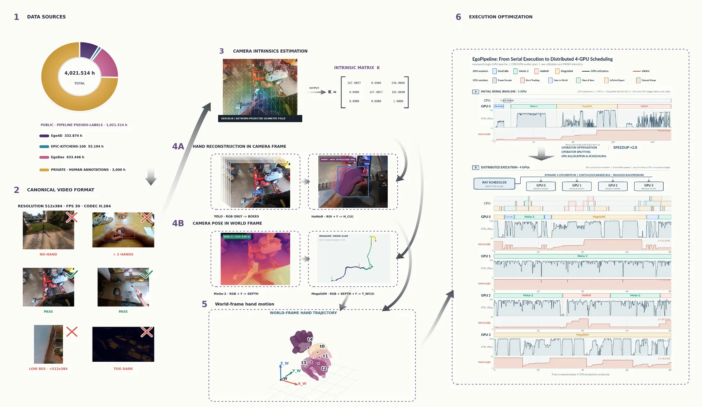

<div align="center">


<h1>MINT：用可扩展的第一视角管线监督<br>训练世界坐标系相机与手部运动的统一模型</h1>

Zijie Zhu<sup>1,3,4</sup> &nbsp;·&nbsp; Weiren Cai<sup>3</sup> &nbsp;·&nbsp; Yizhou Wang<sup>1,3</sup> &nbsp;·&nbsp; Zhenjie Yang<sup>4</sup> &nbsp;·&nbsp; Jiahao Chen<sup>3,\*</sup> &nbsp;·&nbsp; Guanqi He<sup>2,3,\*</sup>

<sub><sup>1</sup>上海科技大学 &nbsp;&nbsp;<sup>2</sup>清华大学 &nbsp;&nbsp;<sup>3</sup>Wuji Technology &nbsp;&nbsp;<sup>4</sup>香港大学 &nbsp;&nbsp;<sup>\*</sup>通讯作者</sub>

[](#-引用)
[](https://huggingface.co/ZZJAsher/mint_v1)
[](https://huggingface.co/datasets/ZZJAsher/wuji_ego_mint)
[](https://www.modelscope.cn/models/AsherZhu/mint_v1)
[](LICENSE)
[](environments/mint-inference.yml)
[](#-快速开始web-viewer)

[English](README.md)

</div>

<!--
  完整宣传片（1 分 41 秒）。GitHub 只为 github.com/user-attachments 链接渲染内嵌
  播放器，而这种链接只能通过浏览器上传获得：在本仓库任意 issue / PR 的评论框里把
  MP4 拖进去，复制生成的 https://github.com/user-attachments/assets/... 链接，
  单独一行粘贴到这里。不要把 MP4 提交进仓库 —— 指向仓库文件的 <video> 标签会被
  GitHub 的 markdown 过滤器整段删掉，页面上什么都不会显示。
-->


<div align="center"><sub>一段来自 <b>HOT3D</b> 的单目第一视角视频，该数据集完全留出。每一对里左侧是设备采集的真值，右侧是 MINT 的预测：第一视角 MANO 叠加、世界坐标系下的相机与双手轨迹、以及重定向到 MuJoCo 中的 Wuji 灵巧手。单次前向，无逐序列优化，无测试时调参。</sub></div>

---

### 🤲 认识 MINT —— 一段 RGB 视频，一次前向，直接给出世界坐标系下的相机与双手运动

行为理解、机器人模仿学习和 AR 想要的是同一件事：**佩戴者去了哪里、两只手做了什么，而且是在世界坐标系下。** 今天要拿到这份状态，得把相机标定 → 单目深度 → SLAM → 手部重建 → 轨迹清理串成一条链。MINT 在部署阶段把这条链换掉。

- **一个统一模型，而不是五级串行链。** 共享的时空表征同时驱动相机外参头、独立视场角头、相机坐标系 MANO 头和逐帧手部存在性头，再由显式可微的刚体组合得到世界坐标系手部运动。推理时不出深度图、不出点云、不需要任何稠密 3D 中间结果。
- **结构化管线摊销（structured pipeline amortization）。** 多级管线保留下来 —— 但放到线下，只作为监督信号的生成器 —— 然后用一个模型去学它最终那份结构化状态。这不是 logit 蒸馏：学生学的是一整套非端到端系统输出的结构化相机–手部状态。
- **端到端开源。** 模型权重、训练与推理代码、EgoPipeline 标注系统，以及经过严格过滤的 **1,021 小时**结构化第一视角数据集 —— 并且把这份发布自身的局限也写清楚，而不是藏起来。


<div align="center"><sub>同一批帧，同一套叠加渲染。左：输入。中：传统五级路线，其输出是<b>伪标签，不是真值</b>。右：MINT，一次前向。这是定性示例，片段由可度量的叠加偏差排序挑出，而非人工挑选，依据见 <a href="assets/readme/SOURCES.md">assets/readme/SOURCES.md</a>。精度结论只在 <a href="#-评测口径">评测口径</a> 一节给出，绝不用图片代替。</sub></div>

---

## 📑 目录

<details>
<summary>点击展开</summary>

- [📰 更新](#-更新)
- [📋 发布状态](#-发布状态)
- [🚀 快速开始：Web Viewer](#-快速开始web-viewer)
  - [模型与资产放置路径](#模型与资产放置路径)
  - [使用 Viewer](#使用-viewer)
- [🧠 MINT 是怎么工作的](#-mint-是怎么工作的)
  - [模型速览](#模型速览)
  - [监督信号从哪里来](#监督信号从哪里来)
  - [为什么用一个模型替掉整条链](#为什么用一个模型替掉整条链)
- [📊 评测口径](#-评测口径)
- [📦 功能范围](#-功能范围)
- [🏋️ 模型训练与可选管线复现](#️-模型训练与可选管线复现)
- [🗂️ 公开 Ego 预训练数据](#️-公开-ego-预训练数据)
- [🔐 LeRobot 样例与隐私](#-lerobot-样例与隐私)
- [⚠️ 已知局限](#️-已知局限)
- [🧾 仓库结构](#-仓库结构)
- [📚 文档](#-文档)
- [✨ 致谢](#-致谢)
- [📜 许可证](#-许可证)
- [📖 引用](#-引用)
- [📮 联系方式](#-联系方式)

</details>

---

## 📰 更新

- **2026-08-19** —— 统一了 Viewer 中所有可视化的预测标签，GT 与预测面板不会再被看混。
- **2026-08-18** —— 优化 Viewer 渲染，并把 UKF 平滑参数开放到面板上。
- **2026-08-16** —— Benchmark 面板接入 Viewer；Wuji 灵巧手的重定向（`eval/simulate/wuji-retargeting`）开源；打包已审核的 Hot3D LeRobot v3 样例。
- **2026-08-15** —— 首次公开发布：推理与训练代码、checkpoint 下载流程，以及 1,021 小时结构化数据集（Hugging Face 与 ModelScope 双平台）。

## 📋 发布状态

| | 内容 | 位置 |
| :-- | :-- | :-- |
| ✅ | MINT checkpoint，11.31 亿参数 | [Hugging Face](https://huggingface.co/ZZJAsher/mint_v1) · [ModelScope](https://www.modelscope.cn/models/AsherZhu/mint_v1) |
| ✅ | 推理、Web Viewer、训练代码 | 本仓库 |
| ✅ | 1,021 小时结构化第一视角数据集（非视频部分） | [Hugging Face](https://huggingface.co/datasets/ZZJAsher/wuji_ego_mint) · [ModelScope](https://www.modelscope.cn/datasets/AsherZhu/wuji_ego_mint) |
| ✅ | Benchmark 实现与 CLI，已接入 Viewer | `eval/model_effect/benchmark/` |
| ✅ | EgoPipeline 调度、清理与 LeRobot 导出参考实现 | `ray_pipeline/` |
| ✅ | Wuji 灵巧手 URDF/MJCF/STL 与重定向 | `eval/simulate/wuji-retargeting/` |
| ⏳ | HOT3D / ARCTIC 零样本结果表 | 随论文一起公布；**在那之前本文不引用任何精度数字** |
| ⏳ | 已发布数据的尺度校正相机轨迹 | 见 [已知局限](#️-已知局限) |
| ❌ | 受许可证限制的管线适配（改动过的 HaWoR 源码、权重、MANO） | 不能再分发，见 [`THIRD_PARTY_NOTICES.md`](THIRD_PARTY_NOTICES.md) |

## 🚀 快速开始：Web Viewer

Web Viewer 是 MINT 的主要入口，可以在一个界面中选择 checkpoint、加载 MINT 模型、对 LeRobot episode 或 Ego 视角的 MP4 视频运行推理，并查看 GT/预测叠加、相机轨迹、手部运动、逐帧指标和 benchmark 结果。

> **硬件要求：MINT 模型推理需要 NVIDIA GPU，显存至少为 24 GB。**

安装推理环境、下载公开 MINT 模型并准备 MANO 手部模型，然后启动 Viewer。MANO 需要在[官方网站](https://mano.is.tue.mpg.de/)注册账号、接受许可证并手动下载，本项目不能代为下载或分发：

```bash
git clone https://github.com/wuji-technology/wuji-ego-mint.git
cd wuji-ego-mint
bash scripts/create_env.sh inference
conda activate mint-inference
bash scripts/download_assets.sh

# 从下载并解压后的 MANO 文件中复制左右手模型。
mkdir -p assets/mano/mano_right assets/mano/mano_left
cp /path/to/MANO_RIGHT.pkl assets/mano/mano_right/MANO_RIGHT.pkl
cp /path/to/MANO_LEFT.pkl assets/mano/mano_left/MANO_LEFT.pkl

python -m mint doctor --profile inference
python -m mint viewer
```

### 模型与资产放置路径

Quick Start 使用的模型与资产请按下表放置。`scripts/download_assets.sh` 会自动下载公开 MINT checkpoint；MANO 需由使用者从官方网站下载后手动复制。

| 模型或资产 | 下载来源 | 仓库内放置路径 | 说明 |
| --- | --- | --- | --- |
| MINT checkpoint | [ModelScope](https://www.modelscope.cn/models/AsherZhu/mint_v1) 或 [Hugging Face](https://huggingface.co/ZZJAsher/mint_v1) | `checkpoints/model.safetensors` | 下载脚本会自动放置并校验；手动下载时也应使用该路径。 |
| MANO 左右手模型 | [MANO 官网](https://mano.is.tue.mpg.de/) | `assets/mano/mano_right/MANO_RIGHT.pkl`<br>`assets/mano/mano_left/MANO_LEFT.pkl` | 需要注册并接受 MANO License。 |
| LingBot-Map 预训练骨干 | [LingBot-Map](https://github.com/robbyant/lingbot-map) | `assets/models/lingbot-map.pt` | 可选资产，仅在对应配置需要时下载。 |
| Wuji Hand URDF、MJCF 和 STL | 已包含在本仓库 | `eval/simulate/wuji-retargeting/wuji_retargeting/wuji-description/hand/body/` | 无需额外下载。 |

如果需要复现 Ego 数据生产管线，还需根据各上游项目的许可证自行下载相应权重，并放到以下固定路径：

| 数据管线资产 | 仓库内放置路径 |
| --- | --- |
| GeoCalib 权重 | `model/geocalib/pinhole.tar` |
| MoGe 权重 | `model/moge2/model.pt` |
| Mega-SAM 权重 | `model/megasam/megasam_final.pth` |
| HaWoR 权重 | `model/hawor/hawor.ckpt` |
| HaWoR 配置 | `model/hawor/model_config.yaml` |
| HaWoR 检测器 | `model/hawor/detector.pt` |
| DROID-SLAM 权重 | `third_party/HaWoR/weights/external/droid.pth` |
| Metric3D 权重 | `third_party/HaWoR/thirdparty/Metric3D/weights/metric_depth_vit_large_800k.pth` |
| HaWoR 右手 MANO | `third_party/HaWoR/_DATA/data/mano/MANO_RIGHT.pkl` |
| HaWoR 左手 MANO | `third_party/HaWoR/_DATA/data_left/mano_left/MANO_LEFT.pkl` |

Benchmark 数据没有强制的仓库内目录，可在运行时通过 `--data-root /path/to/benchmark-data` 指向下载并整理后的 HOT3D、ARCTIC 等数据集。

### 使用 Viewer

Viewer 启动后会自动在默认浏览器打开 `http://127.0.0.1:8011`，然后依次操作：

1. 在 **模型与样本** 中保留 `checkpoints/model.safetensors`，或者选择其他兼容 checkpoint。
2. 点击 **加载模型**，等待模型状态变为就绪。
3. 选择 LeRobot episode 或 Ego 视角的 MP4 视频，并设置相机推理、手部拼窗和几何参数。
4. 点击 **开始推理**。
5. 查看同步的 GT/Pred 2D、固定世界和当前相机 3D、逐帧数值、loss、导出及可选 benchmark 工具。


所有可视化操作都在 Viewer 面板中完成，不需要额外的命令行可视化步骤。安装、CUDA、MANO 与离线部署细节见 [安装指南](docs/installation.md)。

## 🧠 MINT 是怎么工作的


每帧只编码一次，四个头分工预测，再用显式刚体变换组合到世界坐标系 —— 于是世界坐标系下的误差会同时更新相机分支和手部分支。

### 模型速览

| | |
| --- | --- |
| **输入** | 单目第一视角 RGB，378 × 518，patch 14，每帧 999 token |
| **骨干** | LingBot-Map / GCT —— 24 组帧内注意力与全局注意力交替 |
| **片段** | T = 32 帧，重新锚定到窗口自身的第一帧 |
| **参数量** | 11.31 亿（可训练） |
| **头 01** | 相机外参，7 维 `[t, q]`，因果迭代精化 4 步 |
| **头 02** | 视场角，`f_h, f_w`，独立时序分支 + Softplus |
| **头 03** | 相机坐标系手部 MANO，218 维，左右手，部件查询 + 2 次精化 |
| **头 04** | 逐帧手部存在性，左/右 logits，patch 交叉注意力 |
| **组合** | `x_c = R x_w + t`、`p_w = Rᵀ(p_c − t)`、`Q_w = Rᵀ Q_c` —— 显式且可微 |
| **推理时** | 不出深度图、不出点云、无稠密 3D 中间结果 |
| **训练** | Stage 1 在 1,021 小时管线监督上预训练 → Stage 2 用小规模高精度相机–手部数据校准 |


### 监督信号从哪里来



**EgoPipeline** 是我们对传统多级路线的开源实现。它在本项目里的角色是*监督信号生成器*，而不是部署路径：

| 阶段 | 组件 | 产出 |
| --- | --- | --- |
| 00 | 预处理 | 校验元数据、每段只解码一次、切分重叠片段、丢弃过短与脏数据 |
| 01 | GeoCalib | 相机内参 |
| 02 | MoGe-2 | 单目深度 |
| 03 | MegaSaM / DROID-SLAM | 米制相机轨迹 |
| 04 | HaWoR | 相机坐标系 MANO |
| 05 | 清理 | 剔除离群点、插补缺口、时序滤波 |

它的输出是**伪标签，不是真值** —— 这个区分在本仓库里处处生效。

### 为什么用一个模型替掉整条链


串行链有一些靠工程优化消不掉的结构性代价：每一级都要把同一段视频重新编码一次；相机和手部只在后处理里才相遇；每一级的上限都被它前面那一级锁死；任何一个算子退化，整条记录都会退化。在完整流程口径下 —— 原始视频进、存储好的统一结构化状态出，输入与硬件完全一致 —— 统一模型达到 **EgoPipeline 有效数据产出吞吐的 5.0 倍**。这个数字算的是端到端数据生产，*不是*模型前向时间；而且作为基线的 EgoPipeline 本身已经做过分布式优化（Ray 多卡算子、常驻 worker、异步 CPU 阶段）。


<div align="center"><sub>来自三个已发布语料的 108 个 MINT 渲染片段同时播放。完整发布量为 1,021.514 小时 · 560,649 个 episode · 110,323,558 帧结构化监督。</sub></div>

## 📊 评测口径

**本文不给出任何精度数字。** 零样本结果表随论文一起公布；在那之前，能精确说明的是评测口径。

- **完全留出。** HOT3D 与 ARCTIC 的图像、管线标签和真值，全部排除在训练、高精度校准、超参与 loss 权重选择、checkpoint 选择之外，且不做测试时调参。只有满足这一条件的模型才能进入零样本主表。
- **划分规则。** 所有官方划分都在切片之前按原始视频 ID 完成；只要有参与者 ID，就再做一次参与者级隔离。
- **输入对所有方法一致。** 所有学习类方法共享输入、评测预处理和固定的评测 manifest，序列级失败按同一规则计入。无法同时输出相机与手部的方法记为 N/A —— 绝不用别的方法的输出去顶替。
- **唯一的不对称，明说。** 如果某个对比方法用的是它自己在 HOT3D/ARCTIC 上的训练与评测设置（而非零样本），这一差异会被明确标注，而不是平均掉。

**Benchmark 结果诚信声明。** 我们承诺，本项目报告的每一项测试指标均为按照所述评测协议实际运行所得的真实结果，不会对原始数值进行任何人为修改。如需精确复现其他方法或 baseline 的具体数值，请直接使用对应方法的官方仓库与原始环境。MINT 使用的指标定义、对齐规则、聚合逻辑和报告代码均公开在 `eval/model_effect/benchmark/` 中，可直接检查具体计算方式。

`eval/model_effect/benchmark/` 与对应测试完整开源，并已接入 Viewer 顶栏的 Benchmark 面板。使用前需自行下载 HOT3D 和 ARCTIC，按各 adapter 要求组织数据并安装可选依赖；也可独立运行 CLI：

```bash
python eval/model_effect/benchmark/run.py \
  --ckpt /path/to/checkpoint \
  --config configs/training/mint_step2.yaml \
  --data-root /path/to/benchmark-data
```

相机轨迹数据也可通过 `CAMERA_TRAJECTORY_ROOT` 配置。Aliyun 分布式执行的 `defaults.yaml` 仅提供占位模板，workspace、resource、镜像、CPFS、凭证及环境均由使用者自行配置；项目不代建或维护 benchmark 环境。

## 📦 功能范围

| 模块 | 命令 | 用途 |
| --- | --- | --- |
| 推理与可视化 | `python -m mint viewer` | Web 界面查看 LeRobot GT、模型预测、2D/3D 轨迹与逐帧指标。 |
| 模型训练 | `python -m mint train` | 使用 Accelerate/DDP 训练相机与手部 MINT 模型。 |
| 模型评测 | `python eval/model_effect/benchmark/run.py` | 运行开源 benchmark CLI；数据集和运行环境由使用者配置。 |
| 环境检查 | `python -m mint doctor` | 检查依赖、可选后端、模型资产和运行环境。 |
| 管线参考 | `ray_pipeline/` | 在本地整合所需上游后端后，复用已开源的 Ray 调度、接口、轨迹清理和 LeRobot 导出代码。 |

## 🏋️ 模型训练与可选管线复现

模型训练或本地数据管线开发需要完整环境：

```bash
bash scripts/create_env.sh full
conda activate mint
python -m mint doctor --profile full
```

公开版本以 Viewer 作为 MINT 模型推理、可视化和结果导出的统一入口。本项目仅提供第三方许可证允许公开发布的代码；受许可证限制的第三方适配与内部集成不包含在本仓库中，**因此本仓库不包含完整的生产数据流程。**

GeoCalib、MoGe 和 Mega-SAM 的源码快照位于 `third_party/`，但生产管线使用的部分第三方适配代码受上游许可证限制，无法公开。其中，当前机器上修改过的 HaWoR 源码因 CC BY-NC-ND 禁止分发修改版而保持 Git 忽略。所有权重、MANO 文件和其他需单独授权的资产也不随仓库发布。

如果确实需要复现数据生成管线，请先阅读 [`THIRD_PARTY_NOTICES.md`](THIRD_PARTY_NOTICES.md)，按各自许可条款自行获取和安装所有上游库与资产，再在本地补充必要的兼容适配。`ray_pipeline/` 已开源的代码可作为调度、接口、数据流、轨迹清理、Manifest 和 LeRobot 导出协议的实现参考。可使用 AI 编程工具帮助理解上游 API 差异并完成兼容层，但整合结果及其许可合规性由使用者负责。只有在完成这些本地整合后，才应将 `python -m mint doctor --profile data` 和 `python -m mint pipeline` 视为可用入口。

公开版本提供的是实现参考，而不是生产数据生成器的一键复现。请直接使用 MINT 进行模型推理；如需复现数据管线，请自行准备已授权的上游源码和资产，并按[数据管线文档](docs/data-pipeline.md)完成本地整合。

### 训练模型

训练配置只保留与两个指定 checkpoint 对应的两阶段配置。`step_00019000` 是 Stage 1；`step_00004500` 是从 Stage 1 权重初始化、仅训练 WorldEngine 相机头的 Stage 2，也是微调完成后开源发布的最终模型 checkpoint：

```bash
python -m mint train --config configs/training/mint_step1.yaml

python -m mint train --config configs/training/mint_step2.yaml
```

Stage 2 配置中的 `train.init_from` 已指向 Stage 1 的 `step_00019000/model.safetensors`。

`mint train` 消费由使用者单独准备的兼容 LeRobot 数据集并产出训练 checkpoint。训练完成后，可直接在 Viewer 面板中选择并检查新的 checkpoint。

## 🗂️ 公开 Ego 预训练数据

我们提供了由本仓库 Ego 数据生产管线处理得到的 `ego4d`、`egodex` 和 `epickitchen` 非视频数据：

- [Hugging Face：ZZJAsher/wuji_ego_mint](https://huggingface.co/datasets/ZZJAsher/wuji_ego_mint)
- [ModelScope：AsherZhu/wuji_ego_mint](https://www.modelscope.cn/datasets/AsherZhu/wuji_ego_mint)

| | |
| --- | --- |
| 结构化监督内容 | 相机轨迹、双手 MANO、逐帧存在性、世界坐标系运动 |
| 过滤与轨迹清理后保留 | **1,021.514 小时** · 560,649 个 episode · 110,323,558 帧 |
| 来源 | Ego4D 332.874 h · EPIC-KITCHENS-100 55.194 h · EgoDex 633.446 h |
| 通过率 | 1,729 原始小时的 59.1 % |

> **重要说明：这些数据中的相机轨迹由本仓库的 Ego 数据管线处理生成，当前存在明显的尺度放大现象。建议仅将其用于本项目 Ego 手部重建模型的预训练，不建议用于真实尺度评估、精确相机轨迹评测或作为真实尺度 Ground Truth。**

公开数据集不包含 `.mp4` 视频。原始视频分别来自 Ego4D、EgoDex 和 EPIC-KITCHENS，受各自数据集许可证及访问条款约束，无法由本项目重新分发。需要视频的使用者应从对应数据集官方渠道申请和下载，并自行确认使用与再分发权限。

## 🔐 LeRobot 样例与隐私

仓库只保留 `data/samples/lerobot_v3/` 这一套小样例：从排序后的 Hot3D 序列 export 中选择 8 段操作内容不同的片段，各截取居中 15 秒，合成一个合法的 **8 episode、3,600 帧** LeRobot v3 数据集 —— 512 × 512、30 fps、磁盘占用 21 MB，包含同步 H.264 视频、Hot3D 相机与双手标注、任务文本和 episode 元数据。样例不记录参与者 ID 或原始序列名，只在 `lerobot_v3/sample_manifest.json` 里保留匿名来源索引和居中帧范围。

可从本地已有的完整 export 重建：

```bash
python scripts/build_sample_lerobot.py \
  --source-root /path/to/hot3d_to_lerobot \
  --output data/samples/lerobot_v3
```

能够获取数据不等于拥有再次分发的权利；发布者仍需确认许可证、参与者授权并完成逐帧隐私检查。详细要求见 [隐私说明](docs/privacy.md)。

## ⚠️ 已知局限

这些事情我们宁愿你在这里读到，而不是事后才发现：

- **EgoPipeline 的输出是伪标签，不是真值。** 所有关于 MINT 精度的结论都改用留出的真实真值来度量。
- **已发布的相机轨迹仍存在尺度放大**（见上文警示）。请用于预训练，不要用于米制评测。
- **32 帧片段训练本身不能证明长视频一致性。** 长序列行为会单独报告，不从片段级精度外推。
- **存在性标签继承了固定的检测器阈值。** 共享时序特征让学生能纠正教师的孤立漏检和误检，而这一点是对照盲评的存在性标注来审计的，不是对照它训练时用的伪标签。
- **本仓库不是完整的生产数据管线。** 受许可证限制的适配按设计排除在外，见 [模型训练与可选管线复现](#️-模型训练与可选管线复现)。

## 🧾 仓库结构

```text
mint/
|-- configs/          两阶段训练配置与推理设置
|-- data/samples/     已审核的 Hot3D LeRobot v3 小样例
|-- eval/model_effect 原版可视化、推理适配器与 benchmark
|-- docs/             架构与运行文档（英文）
|-- environments/     完整环境与最小推理环境定义
|-- mint/             CLI、推理引擎、渲染器和 Viewer
|-- model_train/      训练引擎、模型、损失函数和数据加载器
|-- ray_pipeline/     Ray 调度、Actor、模型后端、轨迹清理、Manifest 和数据导出
|-- scripts/          环境、资产、隐私和样例处理脚本
`-- third_party/      可分发源码快照；HaWoR 适配源码仅本地，权重和授权资产不包含
```

## 📚 文档

| | |
| --- | --- |
| [架构](docs/architecture.md) | 模型与仓库如何组织在一起 |
| [安装](docs/installation.md) | 环境 profile、CUDA、MANO、离线部署 |
| [数据管线](docs/data-pipeline.md) | EgoPipeline 各阶段与本地复现 |
| [训练](docs/training.md) | 两阶段训练配方 |
| [LeRobot 训练数据格式](docs/lerobot-training-data.md) | 兼容数据集需要包含什么 |
| [推理与 Viewer](docs/inference.md) | Viewer 面板、导出、benchmark 工具 |
| [隐私与发布检查](docs/privacy.md) | 授权、审核、再分发 |
| [安全策略](SECURITY.md) | 如何上报安全问题 |
| [第三方声明](THIRD_PARTY_NOTICES.md) | 上游许可证 —— 分发前必读 |
| [README 图片来源](assets/readme/SOURCES.md) | 上面每张图分别出自哪个片段、哪张论文图 |

## ✨ 致谢

MINT 的实现离不开以下研究项目、模型与数据集。

- **[VITRA](https://microsoft.github.io/VITRA/)** — MINT 的数据处理架构、第一视角重建流程、世界坐标系相机/手部标注以及 LeRobot 转换规范均由 VITRA 与 VITRA-1M 数据引擎演进而来。
- **[LingBot-Map](https://github.com/robbyant/lingbot-map)** — 提供 MINT 相机与手部训练、推理所使用的核心模型架构和上游适配源码。
- **[HaWoR](https://github.com/ThunderVVV/HaWoR)** — 为可选数据管线提供单目手部运动重建、MANO 估计、跟踪和世界坐标系手部处理组件；使用时仍须遵守其上游非商业、禁止演绎许可。
- **相机、深度与跟踪研究** — [GeoCalib](https://github.com/cvg/GeoCalib)、[MoGe](https://github.com/microsoft/MoGe)、[Mega-SAM](https://github.com/mega-sam/mega-sam)、[DROID-SLAM](https://github.com/princeton-vl/DROID-SLAM)、[UniDepth](https://github.com/lpiccinelli-eth/UniDepth)、[Metric3D](https://github.com/YvanYin/Metric3D)、[DeepCalib](https://github.com/alexvbogdan/DeepCalib)、[DINOv2](https://github.com/facebookresearch/dinov2)、[VGGT](https://github.com/facebookresearch/vggt)、InfiniteVGGT 和 [PyTorch3D](https://github.com/facebookresearch/pytorch3d)。
- **手部模型、仿真与重定向** — [MANO](https://mano.is.tue.mpg.de)、[SMPL-X](https://smpl-x.is.tue.mpg.de)、[MuJoCo](https://mujoco.org)，以及 Viewer 可选面板使用的 Wuji hand description 与 retargeting 组件。
- **数据集与 benchmark** — [HOT3D](https://github.com/facebookresearch/hot3d)、[ARCTIC](https://arctic.is.tue.mpg.de)、[Ego4D](https://ego4d-data.org)、[EPIC-KITCHENS](https://epic-kitchens.github.io) 和 [EgoDex](https://github.com/apple/ml-egodex)；数据访问和再分发始终以各数据集自身条款为准。

感谢所有上游作者和维护者。致谢不能替代引用或许可证义务；使用或分发前请阅读[第三方声明](THIRD_PARTY_NOTICES.md)。

## 📜 许可证

wuji-ego-mint 原创代码使用 MIT License。上游模型、数据集、MANO 资产、内置的 LingBot-Map 源文件及可选研究后端仍遵循各自许可证。发布前请阅读 [第三方声明](THIRD_PARTY_NOTICES.md)。

## 📖 引用

论文正在审稿中，下面这条会在正式发表后替换：

```bibtex
@misc{zhu2026mint,
  title  = {MINT: Minting a Unified Model for World-Space Camera and Hand Motion
            from Scalable Egocentric Pipeline Supervision},
  author = {Zhu, Zijie and Cai, Weiren and Wang, Yizhou and Yang, Zhenjie and
            Chen, Jiahao and He, Guanqi},
  year   = {2026},
  note   = {Manuscript under review}
}
```

## 📮 联系方式

如果您在安装、数据生成、模型训练、推理或 Viewer 使用过程中遇到任何问题，欢迎直接联系朱子杰。微信：`z3132544408`；邮箱：`3132544408@qq.com`。
