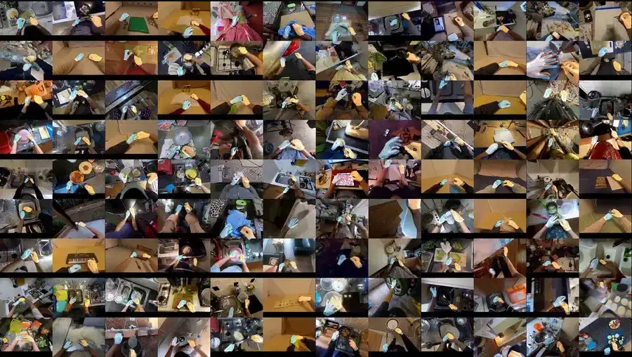
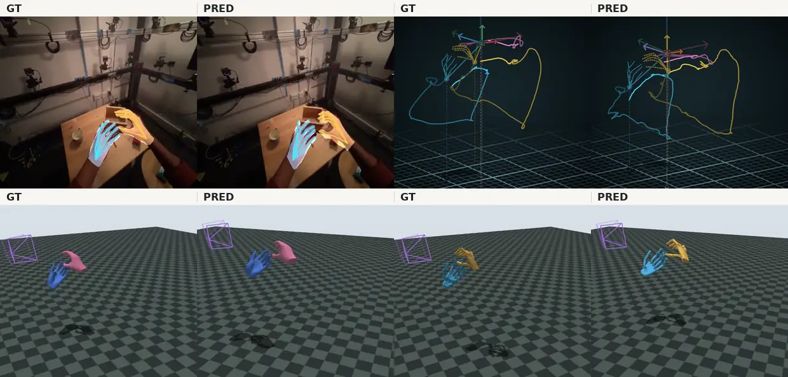
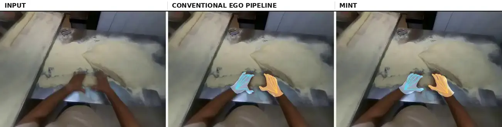
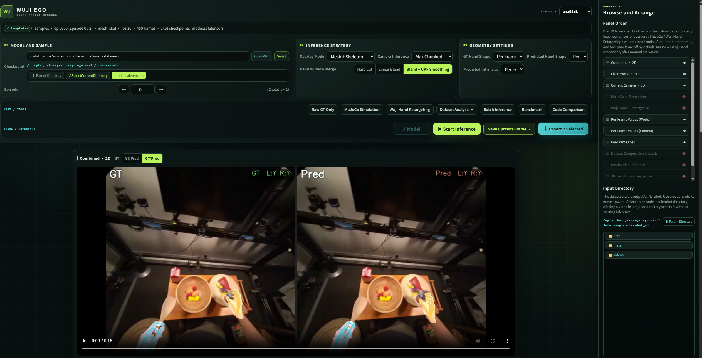
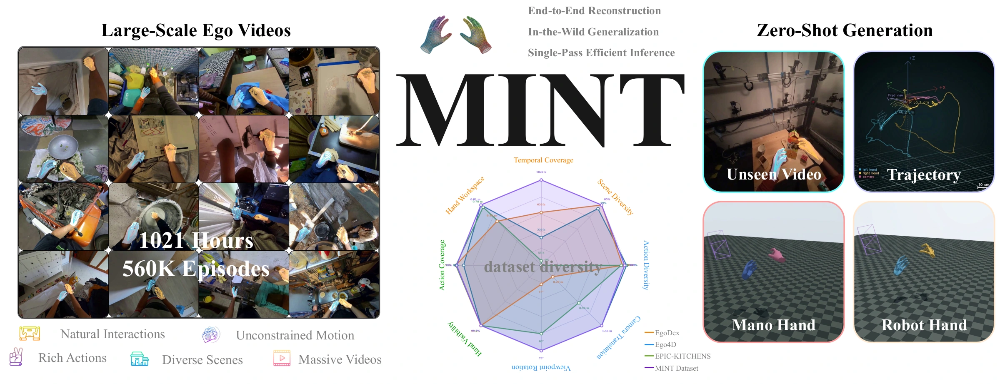
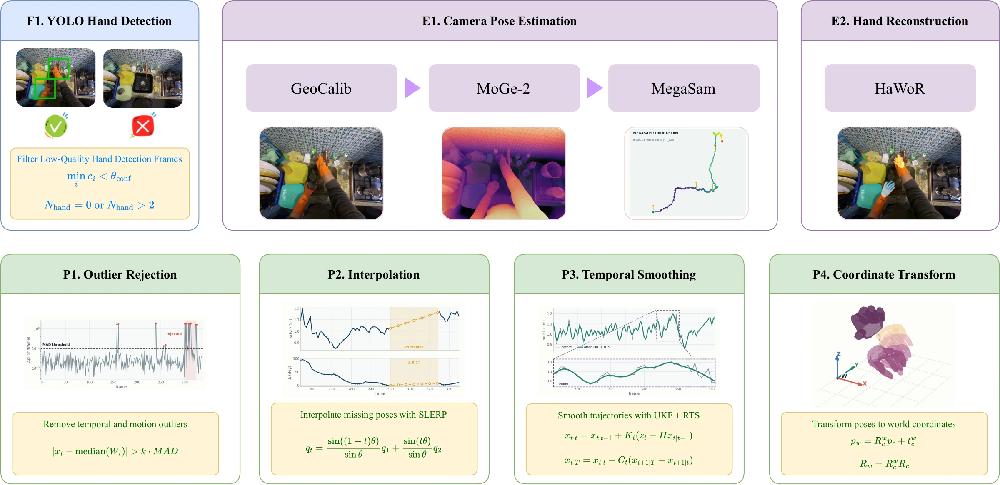
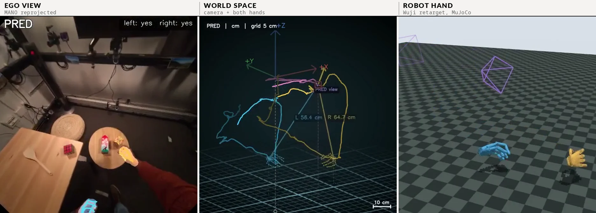

<div align="center">

<!--
  完整宣传片（1 分 49 秒）—— 这里暂时特意不放播放入口。文件已入库，位于
  docs/asset/full_film.mp4（1280 × 720，8.5 MB）；指向它的普通链接已被移除，
  因为「点开跳到 blob 页面」的链接不算播放器。

  真正的内嵌播放器只对 github.com/user-attachments 链接渲染，而这种链接只能通过
  浏览器上传获得：在本仓库任意 issue / PR 的评论框里把 MP4 拖进去，复制生成的
  https://github.com/user-attachments/assets/... 链接，单独一行粘贴到这里，也就是
  封面视频墙之后。（robbyant/lingbot-map 的六个视频都是这么做的，一个都没入库。）
  指向仓库文件的 <video> 标签会被 GitHub 的 markdown 过滤器整段删掉，页面上什么
  都不会显示。

  全画质母版：宣传片工程里的 out/MINT_full_en_music.mp4（1920 × 1080，76 MB，
  特意不入库）。
-->



<h2>MINT：基于可扩展第一视角管线监督的<br>世界坐标系相机与手部运动估计统一模型</h2>

Zijie Zhu<sup>1,3,4</sup> &nbsp;·&nbsp; Weiren Cai<sup>3</sup> &nbsp;·&nbsp; Yizhou Wang<sup>1,3</sup> &nbsp;·&nbsp; Zhenjie Yang<sup>4</sup> &nbsp;·&nbsp; Yide Liu<sup>3,5</sup> &nbsp;·&nbsp; Jiahao Chen<sup>3,\*</sup> &nbsp;·&nbsp; Guanqi He<sup>2,3,\*</sup>

<sub><sup>1</sup>上海科技大学 &nbsp;&nbsp;<sup>2</sup>清华大学 &nbsp;&nbsp;<sup>3</sup>舞肌科技 &nbsp;&nbsp;<sup>4</sup>香港大学 &nbsp;&nbsp;<sup>5</sup>浙江大学 &nbsp;&nbsp;<sup>\*</sup>通讯作者</sub>

<!-- TODO：arXiv 链接上线后填进下面这个 badge。 -->
[](https://1847540790.github.io/mint-project-page/)
[]()
[](https://huggingface.co/ZZJAsher/mint_v1)
[](https://www.modelscope.cn/models/AsherZhu/mint_v1)
[](https://huggingface.co/datasets/ZZJAsher/wuji_ego_mint)
[](https://www.modelscope.cn/datasets/AsherZhu/wuji_ego_mint)
[](LICENSE)

[English](README.md)

</div>



---

### 🤲 认识 MINT —— 让世界坐标系下的第一视角运动数据更易获取

第一视角运动重建需要估计相机如何移动，以及双手在周围空间中的位置、姿态与运动。获取这类数据，通常需要具备定位能力的采集设备，或将相机标定、单目深度、SLAM、手部重建与轨迹清理串成一条处理管线。多个模型的部署、阶段间的误差传递，以及不同的使用许可，都增加了规模化数据生产与维护的成本。

**MINT 以普通第一视角 RGB 视频为输入，通过统一模型预测相机与双手运动，并组合为世界坐标系下的结构化输出。** 使用者可通过 Web Viewer 运行推理并查看结果，模型推理需要显存至少为 24 GB 的 NVIDIA GPU。长视频采用分窗处理，并在窗口之间拼接相机轨迹。

- **统一建模相机与双手。** 共享的时空表征驱动四个预测头，分别估计相机外参、视场角、相机坐标系 MANO 参数与逐帧手部存在性，再通过显式刚体变换得到世界坐标系手部运动。推理时无需生成深度图或点云。
- **结构化管线摊销（structured pipeline amortization）。** EgoPipeline 在线下生成结构化的相机与手部监督，MINT 学习这些标签，从而减少处理新视频时对多个独立模型的部署依赖。
- **开放模型与研究资源。** 项目提供模型权重、训练与推理代码、覆盖 **1,021 小时**第一视角视频的非视频结构化标注，以及 EgoPipeline 调度、清理与导出的参考源码。原始视频和需单独授权的资产仍须按各自的访问与许可条款获取。



<div align="center"><sub>同一批帧，同一套叠加渲染。左：输入。中：传统 ego 管线，其输出是<b>伪标签，不是真值</b>。右：MINT 预测。</sub></div>

---

## 📑 目录

<details open>
<summary>点击收起</summary>

- [📋 发布状态](#-发布状态)
- [🚀 快速开始：Web Viewer](#-快速开始web-viewer)
- [🧠 MINT 是怎么工作的](#-mint-是怎么工作的)
- [📊 评测口径](#-评测口径)
- [📦 功能范围](#-功能范围)
- [🏋️ 模型训练与可选管线复现](#️-模型训练与可选管线复现)
- [🗂️ 公开 Ego 预训练数据](#️-公开-ego-预训练数据)
- [⚠️ 局限与未来工作](#️-局限与未来工作)
- [🧾 仓库结构](#-仓库结构)
- [📚 文档](#-文档)
- [✨ 致谢](#-致谢)
- [📜 许可证](#-许可证)
- [📖 引用](#-引用)

</details>

---

## 📋 发布状态

| | 内容 | 位置 |
| :-- | :-- | :-- |
| ✅ | MINT checkpoint，总参数量 1.139B | [Hugging Face](https://huggingface.co/ZZJAsher/mint_v1) · [ModelScope](https://www.modelscope.cn/models/AsherZhu/mint_v1) |
| ✅ | 推理、Web Viewer、训练代码 | 本仓库 |
| ✅ | 1,021 小时结构化第一视角数据集（非视频部分） | [Hugging Face](https://huggingface.co/datasets/ZZJAsher/wuji_ego_mint) · [ModelScope](https://www.modelscope.cn/datasets/AsherZhu/wuji_ego_mint) |
| ✅ | Benchmark 实现与 CLI，已接入 Viewer | `eval/model_effect/benchmark/` |
| ✅ | EgoPipeline 调度、清理与 LeRobot 导出参考实现 | `ego_pipeline/` |
| ✅ | 视频规格化与手部过滤脚本 | [`ego_pipeline/preprocessing/`](ego_pipeline/preprocessing/) |
| ✅ | Wuji 灵巧手 URDF/MJCF/STL 与重定向 | `eval/simulate/wuji-retargeting/` |
| ✅ | HOT3D / ARCTIC 零样本结果表（论文 Table 1） | [相机系下的双手重建](#相机系下的双手重建) |
| ⏳ | 相机轨迹的尺度校正版本 —— 已发布数据集中的相机轨迹存在尺度放大 | 现有轨迹可用于预训练，不可用于米制评测，成因见[公开 Ego 预训练数据](#️-公开-ego-预训练数据) |
| ❌ | 受许可证限制的管线适配（改动过的 HaWoR 源码、权重、MANO） | 不能再分发，见 [`THIRD_PARTY_NOTICES.md`](THIRD_PARTY_NOTICES.md) |

## 🚀 快速开始：Web Viewer

Web Viewer 是 MINT 的主要入口，可以在一个界面中选择 checkpoint、加载 MINT 模型、对 LeRobot episode 或 Ego 视角的 MP4 视频运行推理，并查看 GT/预测叠加、相机轨迹、手部运动、逐帧指标和 benchmark 结果。

> **硬件要求：MINT 模型推理需要 NVIDIA GPU，显存至少为 24 GB。**

安装推理环境、下载公开 MINT 模型并准备 MANO 手部模型，然后启动 Viewer。MANO 需要在[官方网站](https://mano.is.tue.mpg.de/)注册账号、接受许可证并手动下载，本项目不能代为下载或分发：

```bash
git clone https://github.com/wuji-technology/wuji-ego-mint.git
cd wuji-ego-mint
bash scripts/create_env.sh inference
conda activate mint-inference
bash scripts/download_assets.sh

# 从下载并解压后的 MANO 文件中复制左右手模型。
mkdir -p assets/mano/mano_right assets/mano/mano_left
cp /path/to/MANO_RIGHT.pkl assets/mano/mano_right/MANO_RIGHT.pkl
cp /path/to/MANO_LEFT.pkl assets/mano/mano_left/MANO_LEFT.pkl

python -m mint doctor --profile inference
python -m mint viewer
```

### 模型与资产放置路径

Quick Start 使用的模型与资产请按下表放置。`scripts/download_assets.sh` 会自动下载公开 MINT checkpoint；MANO 需由使用者从官方网站下载后手动复制。

| 模型或资产 | 下载来源 | 仓库内放置路径 | 说明 |
| --- | --- | --- | --- |
| MINT checkpoint | [ModelScope](https://www.modelscope.cn/models/AsherZhu/mint_v1) 或 [Hugging Face](https://huggingface.co/ZZJAsher/mint_v1) | `checkpoints/model.safetensors` | 下载脚本会自动放置并校验；手动下载时也应使用该路径。 |
| MANO 左右手模型 | [MANO 官网](https://mano.is.tue.mpg.de/) | `assets/mano/mano_right/MANO_RIGHT.pkl`<br>`assets/mano/mano_left/MANO_LEFT.pkl` | 需要注册并接受 MANO License。 |
| LingBot-Map 预训练骨干 | [LingBot-Map](https://github.com/robbyant/lingbot-map) | `assets/models/lingbot-map.pt` | 可选资产，仅在对应配置需要时下载。 |
| Wuji Hand URDF、MJCF 和 STL | 已包含在本仓库 | `eval/simulate/wuji-retargeting/wuji_retargeting/wuji-description/hand/body/` | 无需额外下载。 |

### 使用 Viewer

Viewer 启动后会自动在默认浏览器打开 `http://127.0.0.1:8011`，然后依次操作：

1. 在 **模型与样本** 中保留 `checkpoints/model.safetensors`，或者选择其他兼容 checkpoint。
2. 点击 **加载模型**，等待模型状态变为就绪。
3. 选择 LeRobot episode 或 Ego 视角的 MP4 视频，并设置相机推理、手部拼窗和几何参数。
4. 点击 **开始推理**。
5. 查看同步的 GT/Pred 2D、固定世界和当前相机 3D、逐帧数值、loss、导出及可选 benchmark 工具。导出菜单既可把所选画面合成一支网格 MP4，也可将 2D、固定世界 3D、MuJoCo 和 Wuji Hand 的 GT/PRED 结果分别导出为 8 支独立 MP4，并打包为 ZIP 下载。



**要测试自己的视频**，不需要改配置、也不需要走命令行：在 Viewer 右下方的输入目录里浏览到视频所在路径，点击选中即可。支持的格式为 `.mp4`、`.mov`、`.avi`、`.mkv`、`.webm`。裸视频没有真值，Viewer 会进入纯预测模式 —— GT 面板、GT/Pred 并排布局与 loss 读数都会隐藏，画面上的全部内容都是预测结果。

所有可视化操作都在 Viewer 面板中完成，不需要额外的命令行可视化步骤。安装、CUDA、MANO 与离线部署细节见 [安装指南](docs/installation.md)。

## 🧠 MINT 是怎么工作的



<div align="center"><sub>左侧：本次发布的监督数据 —— <b>1,021 小时</b>、<b>56 万</b> episode 的第一视角视频，以及它与 EgoDex、Ego4D、EPIC-KITCHENS 在多样性上的对比。右侧：MINT 对一段未见过的视频的预测 —— 世界坐标系相机与手部轨迹、MANO 手，以及重定向到机器人手的同一段运动。</sub></div>

每个窗口内，四个预测头共享时空表征，分别预测相机与手部状态，再通过显式刚体变换组合为世界坐标系下的运动。

### 模型速览

| | |
| --- | --- |
| **输入** | 单目第一视角 RGB，378 × 518，patch 14，每帧 999 token |
| **骨干** | LingBot-Map / GCT —— 24 组帧内注意力与全局注意力交替 |
| **片段** | T = 32 帧，重新锚定到窗口自身的第一帧 |
| **总参数量** | 1.139B |
| **头 01** | 相机外参，7 维 `[t, q]`，因果迭代精化 4 步 |
| **头 02** | 视场角，`f_h, f_w`，独立时序分支 + Softplus |
| **头 03** | 相机坐标系手部 MANO，218 维，左右手，部件查询 + 2 次精化 |
| **头 04** | 逐帧手部存在性，左/右 logits，patch 交叉注意力 |
| **组合** | `x_c = R x_w + t`、`p_w = Rᵀ(p_c − t)`、`Q_w = Rᵀ Q_c` —— 显式且可微 |
| **推理时** | 不出深度图、不出点云、无稠密 3D 中间结果 |
| **训练** | Stage 1 在 1,021 小时管线监督上预训练 → Stage 2 用小规模高精度轨迹数据校正相机轨迹，几何编码器与手部、存在性、视场角模块保持冻结 |



<div align="center"><sub>EgoPipeline stages.</sub></div>

### 监督信号从哪里来

**EgoPipeline** 是我们对传统多级路线的开源实现。它在本项目里的角色是*监督信号生成器*，而不是部署路径：

| 阶段 | 组件 | 产出 |
| --- | --- | --- |
| 00 | [预处理与过滤](ego_pipeline/preprocessing/) | 规格化 fps/分辨率/时长；按手部检测切掉无手与多手区间；校验元数据、切分重叠片段 |
| 01 | GeoCalib | 相机内参 |
| 02 | MoGe-2 | 单目深度 |
| 03 | MegaSaM / DROID-SLAM | 米制相机轨迹 |
| 04 | HaWoR | 相机坐标系 MANO |
| 05 | 清理 | 剔除离群点、插补缺口、时序滤波 |

它的输出是**伪标签，不是真值** —— 这个区分在本仓库里处处生效。

### 为什么用一个模型替掉整条链



多级管线通常需要组合多个视觉模型与后处理组件。不同模型可能对同一段视频分别提取特征，中间估计的误差可能跨阶段传播，部署时也需要协调多套依赖与接口。MINT 让相机与手部预测共享时空表征，从而减少处理新视频时的重复特征提取与组件集成工作。

推理吞吐，在 **RTX 4090D** 上实测，512 × 384、30 fps，条件完全一致；时间是**稳态下的每帧边际成本**。加速比以 **VITRA** 为基准 —— 本项目的数据管线 **EgoPipeline** 就是在它的基础上优化来的。表里的三个方法是同一条路线上的三个点：VITRA 起步，EgoPipeline 是管线级优化，MINT 用一个模型替掉整条链。

<table>
<thead>
<tr>
  <th rowspan="2" align="left">方法</th>
  <th colspan="3" align="center">单卡</th>
  <th colspan="3" align="center">四卡</th>
</tr>
<tr>
  <th align="right">时间 ↓<br><sub>ms/帧</sub></th>
  <th align="right">fps ↑</th>
  <th align="right">加速比 ↑<br><sub>相对 VITRA</sub></th>
  <th align="right">时间 ↓<br><sub>ms/帧</sub></th>
  <th align="right">fps ↑</th>
  <th align="right">加速比 ↑<br><sub>相对 VITRA</sub></th>
</tr>
</thead>
<tbody>
<tr><td align="left">VITRA</td><td align="right">1260.0</td><td align="right">0.8</td><td align="right">—</td><td align="right">283.3</td><td align="right">3.5</td><td align="right">—</td></tr>
<tr><td align="left">EgoPipeline</td><td align="right">—</td><td align="right">—</td><td align="right">—</td><td align="right">83.4</td><td align="right">12.0</td><td align="right">3.4×</td></tr>
<tr><td align="left">MINT</td><td align="right"><b>72.4</b></td><td align="right"><b>13.8</b></td><td align="right"><b>17.4×</b></td><td align="right"><b>22.7</b></td><td align="right"><b>44.1</b></td><td align="right"><b>12.5×</b></td></tr>
</tbody>
</table>

和传统管线相比，MINT 单卡快 **17.4 倍**（VITRA 1260.0 → 72.4 ms/帧），四卡快 **12.5 倍**（283.3 → 22.7 ms/帧）。四卡这一组能看出增益来自哪里：把传统管线本身优化一遍（EgoPipeline）占 3.4×（283.3 → 83.4），换成统一模型再压到 22.7。

EgoPipeline 自己也做过分布式优化（Ray 多卡算子、常驻 worker、异步 CPU 阶段）：串行单卡改成 4 卡调度的 worker 池，270 帧的墙钟时间从 179.0 秒降到 63.9 秒，管线内部 **2.8×**。那是含解码与落盘的整段墙钟，和上表的稳态边际成本不是一个口径，两个数字不能相乘。

## 📊 评测口径

### 相机系下的双手重建

**结果来源：表中除 MINT 与 MINT + UKF 外，所有方法的评测结果均引自 ViDiHand 评测。** MINT 与 MINT + UKF 的结果采用本项目[论文](https://1847540790.github.io/mint-project-page/assets/paper/mint-paper.pdf) Table 1 中的报告值。

评测采用论文 Sec. V-A 所述的 coverage-aware 协议：漏检的手不会被排除，而是按标准 MANO 占位手模型的误差计入位姿指标。FAcc、Recall 和 F1 衡量检测表现，MPJPE-p 与 PA-MPJPE-p 衡量关节姿态，GO-p 与 CT-p 衡量手腕朝向和手部位置，Jitter 衡量时序平滑性。

MINT 在 HOT3D 和 ARCTIC 上采用零样本评测设置，其两个训练阶段均未使用上述数据集。由于 ViDiHand（标记为 `*`）的训练数据包含上述两个基准数据集中的大部分数据，其结果仅作为域内参考，不纳入零样本方法的直接比较。`MINT + UKF` 使用与 MINT 相同的模型权重，并在推理阶段应用无迹卡尔曼滤波（UKF），其余评测设置保持一致。

<table>
<thead>
<tr>
  <th rowspan="2" align="left">方法</th>
  <th colspan="3" align="center">检测</th>
  <th colspan="2" align="center">3D 姿态</th>
  <th colspan="2" align="center">朝向与位置</th>
  <th colspan="1" align="center">时序</th>
</tr>
<tr>
  <th align="right">FAcc ↑</th>
  <th align="right">Recall ↑</th>
  <th align="right">F1 ↑</th>
  <th align="right">MPJPE-p ↓<br><sub>mm</sub></th>
  <th align="right">PA-MPJPE-p ↓<br><sub>mm</sub></th>
  <th align="right">GO-p ↓<br><sub>度</sub></th>
  <th align="right">CT-p ↓<br><sub>m</sub></th>
  <th align="right">Jitter ↓<br><sub>mm/frame²</sub></th>
</tr>
</thead>
<tbody>
<tr><th colspan="9" align="left">ARCTIC</th></tr>
<tr><td align="left">InterWild</td><td align="right">0.878</td><td align="right">0.943</td><td align="right">0.959</td><td align="right">30.82</td><td align="right">15.95</td><td align="right">25.39</td><td align="right">0.097</td><td align="right">46.58</td></tr>
<tr><td align="left">HaMeR</td><td align="right">0.875</td><td align="right">0.943</td><td align="right">0.957</td><td align="right">29.20</td><td align="right">14.60</td><td align="right">24.91</td><td align="right">0.095</td><td align="right">18.28</td></tr>
<tr><td align="left">Hamba</td><td align="right">0.833</td><td align="right">0.912</td><td align="right">0.941</td><td align="right">31.23</td><td align="right">17.17</td><td align="right">27.82</td><td align="right">0.110</td><td align="right">15.36</td></tr>
<tr><td align="left">WildHands</td><td align="right">0.879</td><td align="right">0.946</td><td align="right">0.960</td><td align="right">25.70</td><td align="right">13.94</td><td align="right">22.32</td><td align="right">0.058</td><td align="right">12.97</td></tr>
<tr><td align="left">OmniHands</td><td align="right">0.866</td><td align="right">0.949</td><td align="right">0.954</td><td align="right">29.67</td><td align="right">14.20</td><td align="right">24.58</td><td align="right">0.087</td><td align="right">45.31</td></tr>
<tr><td align="left">WiLoR</td><td align="right">0.919</td><td align="right">0.951</td><td align="right">0.974</td><td align="right">22.01</td><td align="right">11.87</td><td align="right">17.36</td><td align="right">0.075</td><td align="right">24.09</td></tr>
<tr><td align="left">Dyn-HaMR</td><td align="right">0.842</td><td align="right">0.918</td><td align="right">0.951</td><td align="right">27.90</td><td align="right">17.02</td><td align="right">25.95</td><td align="right">0.121</td><td align="right">12.84</td></tr>
<tr><td align="left">HaWoR</td><td align="right">0.700</td><td align="right">0.817</td><td align="right">0.895</td><td align="right">45.36</td><td align="right">26.38</td><td align="right">43.33</td><td align="right">0.149</td><td align="right">19.79</td></tr>
<tr><td align="left"><i>ViDiHand*</i></td><td align="right"><i>0.997</i></td><td align="right"><i>0.999</i></td><td align="right"><i>0.999</i></td><td align="right"><i>21.67</i></td><td align="right"><i>9.82</i></td><td align="right"><i>14.64</i></td><td align="right"><i>0.047</i></td><td align="right"><i>3.18</i></td></tr>
<tr><td align="left">MINT</td><td align="right">0.916</td><td align="right">0.957</td><td align="right">0.978</td><td align="right">51.03</td><td align="right">27.71</td><td align="right">24.19</td><td align="right">0.140</td><td align="right">12.26</td></tr>
<tr><td align="left">MINT + UKF</td><td align="right">0.916</td><td align="right">0.957</td><td align="right">0.978</td><td align="right">51.09</td><td align="right">27.70</td><td align="right">24.22</td><td align="right">0.140</td><td align="right">2.54</td></tr>
<tr><th colspan="9" align="left">HOT3D</th></tr>
<tr><td align="left">InterWild</td><td align="right">0.669</td><td align="right">0.881</td><td align="right">0.868</td><td align="right">77.17</td><td align="right">24.81</td><td align="right">58.50</td><td align="right">0.213</td><td align="right">101.16</td></tr>
<tr><td align="left">HaMeR</td><td align="right">0.692</td><td align="right">0.904</td><td align="right">0.883</td><td align="right">68.31</td><td align="right">21.46</td><td align="right">49.64</td><td align="right">0.102</td><td align="right">23.63</td></tr>
<tr><td align="left">Hamba</td><td align="right">0.632</td><td align="right">0.828</td><td align="right">0.853</td><td align="right">71.73</td><td align="right">29.62</td><td align="right">56.53</td><td align="right">0.128</td><td align="right">18.51</td></tr>
<tr><td align="left">WildHands</td><td align="right">0.655</td><td align="right">0.863</td><td align="right">0.844</td><td align="right">52.79</td><td align="right">28.95</td><td align="right">53.93</td><td align="right">0.157</td><td align="right">22.89</td></tr>
<tr><td align="left">OmniHands</td><td align="right">0.649</td><td align="right">0.895</td><td align="right">0.868</td><td align="right">63.28</td><td align="right">22.68</td><td align="right">49.12</td><td align="right">0.133</td><td align="right">69.51</td></tr>
<tr><td align="left">WiLoR</td><td align="right">0.827</td><td align="right">0.897</td><td align="right">0.937</td><td align="right">30.97</td><td align="right">19.98</td><td align="right">25.75</td><td align="right">0.098</td><td align="right">17.98</td></tr>
<tr><td align="left">Dyn-HaMR</td><td align="right">0.614</td><td align="right">0.811</td><td align="right">0.802</td><td align="right">74.21</td><td align="right">38.20</td><td align="right">43.85</td><td align="right">0.571</td><td align="right">44.94</td></tr>
<tr><td align="left">HaWoR</td><td align="right">0.348</td><td align="right">0.499</td><td align="right">0.654</td><td align="right">71.40</td><td align="right">66.03</td><td align="right">79.35</td><td align="right">0.262</td><td align="right">23.87</td></tr>
<tr><td align="left"><i>ViDiHand*</i></td><td align="right"><i>0.948</i></td><td align="right"><i>0.974</i></td><td align="right"><i>0.983</i></td><td align="right"><i>21.51</i></td><td align="right"><i>11.38</i></td><td align="right"><i>15.83</i></td><td align="right"><i>0.040</i></td><td align="right"><i>3.74</i></td></tr>
<tr><td align="left">MINT</td><td align="right">0.940</td><td align="right">0.977</td><td align="right">0.950</td><td align="right">23.61</td><td align="right">10.70</td><td align="right">16.78</td><td align="right">0.073</td><td align="right">11.52</td></tr>
<tr><td align="left">MINT + UKF</td><td align="right">0.940</td><td align="right">0.977</td><td align="right">0.950</td><td align="right">23.62</td><td align="right">10.69</td><td align="right">16.77</td><td align="right">0.073</td><td align="right">2.39</td></tr>
</tbody>
</table>

论文报告的 MINT 在 **HOT3D** 上达到 23.61 mm MPJPE-p 和 10.70 mm PA-MPJPE-p，在 **ARCTIC** 上对应为 51.03 mm 和 27.71 mm。应用 UKF 后，HOT3D 的 Jitter 从 11.52 降至 2.39 mm/frame²，ARCTIC 从 12.26 降至 2.54 mm/frame²，同时 MPJPE-p 与 PA-MPJPE-p 的变化均小于 0.1 mm。目前手部预测头尚未在高精度数据上微调，相关局限与后续方向见[局限与未来工作](#️-局限与未来工作)。

**HaWoR 为 EgoPipeline 提供手部伪标签。** 管线在第 04 级使用它估计相机坐标系 MANO 参数，为 MINT 的手部分支提供监督。这些标签仍包含重建误差，不能视为高精度真值。

### 世界系下的相机轨迹

下表误差指标摘录自[论文](https://1847540790.github.io/mint-project-page/assets/paper/mint-paper.pdf) **Table 2**：HOT3D（27 条序列、94,978 帧）与 ARCTIC P2 验证集（34 条序列、25,883 帧）。序列按**完整长度评测，只做 SE(3) 对齐、不拟合尺度** —— 因此尺度误差会被计入而不是被吸收掉。弧长比定义为**真值轨迹长度 / 预测轨迹长度（GT / Pred）**，逐序列计算后等权平均：大于 1 表示预测路程偏短，小于 1 表示预测路程偏长。`MegaSaM†` 不带深度精化。`MINT w/o stage 2` 从未见过米制真值。加粗标记沿用论文；弧长比的目标为 1。

<table>
<thead>
<tr>
  <th rowspan="2" align="left">方法</th>
  <th colspan="2" align="center">ATE ↓ (mm)</th>
  <th colspan="2" align="center">RPE-T ↓ (mm)</th>
  <th colspan="2" align="center">RPE-R ↓ (度)</th>
  <th rowspan="2" align="right">弧长比<br><sub>GT / Pred → 1</sub></th>
  <th rowspan="2" align="right">ATE ↓<br><sub>%</sub></th>
</tr>
<tr>
  <th align="right">均值</th>
  <th align="right">中位</th>
  <th align="right">均值</th>
  <th align="right">中位</th>
  <th align="right">均值</th>
  <th align="right">中位</th>
</tr>
</thead>
<tbody>
<tr><th colspan="9" align="left">HOT3D</th></tr>
<tr><td align="left">DROID-SLAM</td><td align="right"><b>49.1</b></td><td align="right"><b>39.6</b></td><td align="right">5.36</td><td align="right">3.52</td><td align="right">0.227</td><td align="right">0.146</td><td align="right">0.778</td><td align="right"><b>0.36</b></td></tr>
<tr><td align="left">HaWoR</td><td align="right">200.3</td><td align="right">179.2</td><td align="right">8.60</td><td align="right">7.33</td><td align="right">1.098</td><td align="right">0.928</td><td align="right"><b>0.950</b></td><td align="right">1.28</td></tr>
<tr><td align="left">InfiniteVGGT</td><td align="right">124.8</td><td align="right">100.0</td><td align="right">13.52</td><td align="right">9.67</td><td align="right">1.492</td><td align="right">0.392</td><td align="right">0.556</td><td align="right">0.80</td></tr>
<tr><td align="left">LingBot-Map</td><td align="right">85.5</td><td align="right">51.0</td><td align="right">7.56</td><td align="right">6.18</td><td align="right">0.684</td><td align="right">0.253</td><td align="right">0.712</td><td align="right">0.55</td></tr>
<tr><td align="left">MegaSaM†</td><td align="right">94.4</td><td align="right">65.3</td><td align="right"><b>3.18</b></td><td align="right"><b>2.13</b></td><td align="right"><b>0.082</b></td><td align="right"><b>0.063</b></td><td align="right">0.716</td><td align="right">0.69</td></tr>
<tr><td align="left">MINT w/o stage 2</td><td align="right">524.7</td><td align="right">434.6</td><td align="right">8.75</td><td align="right">8.37</td><td align="right">0.234</td><td align="right">0.229</td><td align="right">0.466</td><td align="right">3.29</td></tr>
<tr><td align="left">MINT</td><td align="right">181.7</td><td align="right">155.5</td><td align="right">4.69</td><td align="right">4.78</td><td align="right">0.284</td><td align="right">0.259</td><td align="right">1.094</td><td align="right">1.15</td></tr>
<tr><th colspan="9" align="left">ARCTIC</th></tr>
<tr><td align="left">DROID-SLAM</td><td align="right">181.5</td><td align="right">49.6</td><td align="right">33.84</td><td align="right">14.25</td><td align="right">1.006</td><td align="right">0.423</td><td align="right"><b>0.964</b></td><td align="right">8.07</td></tr>
<tr><td align="left">HaWoR</td><td align="right">66.2</td><td align="right"><b>29.4</b></td><td align="right">24.08</td><td align="right">4.16</td><td align="right">0.298</td><td align="right"><b>0.151</b></td><td align="right">0.759</td><td align="right">2.87</td></tr>
<tr><td align="left">InfiniteVGGT</td><td align="right">79.0</td><td align="right">69.1</td><td align="right">16.21</td><td align="right">12.63</td><td align="right">1.265</td><td align="right">0.655</td><td align="right">0.284</td><td align="right">3.23</td></tr>
<tr><td align="left">LingBot-Map</td><td align="right">59.6</td><td align="right">62.0</td><td align="right">9.17</td><td align="right">8.47</td><td align="right">0.980</td><td align="right">0.717</td><td align="right">0.591</td><td align="right">2.46</td></tr>
<tr><td align="left">MegaSaM†</td><td align="right"><b>51.4</b></td><td align="right">50.4</td><td align="right">8.73</td><td align="right">5.58</td><td align="right">0.779</td><td align="right">0.725</td><td align="right">1.956</td><td align="right"><b>2.15</b></td></tr>
<tr><td align="left">MINT w/o stage 2</td><td align="right">63.7</td><td align="right">59.3</td><td align="right">3.53</td><td align="right">3.62</td><td align="right"><b>0.251</b></td><td align="right">0.243</td><td align="right">0.755</td><td align="right">2.63</td></tr>
<tr><td align="left">MINT</td><td align="right">81.9</td><td align="right">83.2</td><td align="right"><b>3.39</b></td><td align="right"><b>3.37</b></td><td align="right">0.256</td><td align="right">0.251</td><td align="right">1.412</td><td align="right">3.40</td></tr>
</tbody>
</table>

按照论文 Sec. V-A，**ATE 和 ATE% 衡量全局轨迹精度，RPE-T 与 RPE-R 衡量相对运动精度**。RPE 反映局部运动一致性，完整序列的 ATE 则反映长时间跨度下的累计误差，两者共同刻画重建运动的质量。ATE 与 RPE 先逐序列计算 RMSE，再汇总均值与中位数。

论文报告的 MINT 在 **ARCTIC** 上 RPE-T 均值为 **3.39 mm**，在 **HOT3D** 上为 **4.69 mm**。专用轨迹估计系统在绝对精度上仍有优势：MINT 采用 32 帧窗口，不包含回环检测与全局优化，处理长序列时可能积累漂移，相关讨论见论文 Sec. V-C。

**ATE 上 MINT 不占优**：HOT3D 181.7 mm，DROID-SLAM 49.1 mm。按 GT / Pred 的定义，HOT3D 的弧长比 1.094、ARCTIC 的 1.412 表示预测路程偏短。这些 benchmark 预测结果应与公开预训练数据中存在尺度放大的管线轨迹区分开。HOT3D 上，Stage 2 把弧长比从 0.466 拉到 1.094，将原本偏长的路程校正到更接近目标长度，ATE 从 524.7 mm 降到 181.7 mm。ARCTIC 上，弧长比从 0.755 变为 1.412，ATE 则从 63.7 mm 增至 81.9 mm。

### 评测协议与结果来源

本 README 的手部重建与相机轨迹表以论文 Table 1 和 Table 2 为依据。非 MINT 方法的手部结果保留其 ViDiHand 评测来源，相机轨迹结果采用 Table 2 注明的完整序列协议。采用相同指标定义，并不意味着不同数据划分或评测清单上的结果可以直接比较。

- **手部评测。** coverage-aware 协议通过标准 MANO 占位手模型对漏检的真值手施加误差惩罚，位姿指标同时包含真阳性与假阴性。
- **相机评测。** 每条完整序列只做 SE(3) 对齐，不拟合尺度；ATE 与 RPE 逐序列计算，均值和中位数汇总成功完成评测的序列。
- **复现条件。** 本地结果与参考值比较前，需要核对 checkpoint、数据划分与评测清单、预处理、对齐及聚合设置是否符合对应实验。MINT 的指标定义与报告代码见 [`eval/model_effect/benchmark/`](eval/model_effect/benchmark/)。

**诚信声明。** 我们的 EgoPipeline 管线与 MINT 训练代码支持复现。我们承诺，本项目报告的每一项测试指标均为按照所述评测协议实际运行所得的真实结果，不会对原始数值进行人为修改。如需精确复现其他方法或 baseline 的具体数值，请直接使用对应方法的官方仓库与原始环境。MINT 使用的指标定义、对齐规则、聚合逻辑和报告代码均公开在 `eval/model_effect/benchmark/` 中，可直接检查具体计算方式。

`eval/model_effect/benchmark/` 与对应测试完整开源，并已接入 Viewer 顶栏的 Benchmark 面板。使用前需自行下载 HOT3D 和 ARCTIC，按各 adapter 要求组织数据并安装可选依赖；也可独立运行 CLI：

```bash
python eval/model_effect/benchmark/run.py \
  --ckpt /path/to/checkpoint \
  --config configs/training/mint_step2.yaml \
  --data-root /path/to/benchmark-data
```

相机轨迹数据也可通过 `CAMERA_TRAJECTORY_ROOT` 配置。Aliyun 分布式执行的 `defaults.yaml` 仅提供占位模板，workspace、resource、镜像、CPFS、凭证及环境均由使用者自行配置；项目不代建或维护 benchmark 环境。

## 📦 功能范围

| 模块 | 命令 | 用途 |
| --- | --- | --- |
| 推理与可视化 | `python -m mint viewer` | Web 界面查看 LeRobot GT、模型预测、2D/3D 轨迹与逐帧指标。 |
| 模型训练 | `python -m mint train` | 使用 Accelerate/DDP 训练相机与手部 MINT 模型。 |
| 模型评测 | `python eval/model_effect/benchmark/run.py` | 运行开源 benchmark CLI；数据集和运行环境由使用者配置。 |
| 环境检查 | `python -m mint doctor` | 检查软件依赖、模型导入、后端源码和资产文件。 |
| 管线参考 | `ego_pipeline/` | 在本地整合所需上游后端后，复用已开源的 Ray 调度、接口、轨迹清理和 LeRobot 导出代码。 |

## 🏋️ 模型训练与可选管线复现

模型训练或本地数据管线开发需要完整环境：

```bash
bash scripts/create_env.sh full
conda activate mint
python -m mint doctor --profile full
```

公开版本以 Viewer 作为 MINT 模型推理、可视化和结果导出的统一入口。本项目仅提供第三方许可证允许公开发布的代码；受许可证限制的第三方适配与内部集成不包含在本仓库中，**因此本仓库不包含完整的生产数据流程。**

GeoCalib、MoGe 和 Mega-SAM 的源码快照位于 `third_party/`，但生产管线使用的部分第三方适配代码受上游许可证限制，无法公开。其中，修改过的 HaWoR 源码因 CC BY-NC-ND 禁止分发修改版而不随仓库发布。所有权重、MANO 文件和其他需单独授权的资产也不随仓库发布。

如果确实需要复现数据生成管线，请先阅读 [`THIRD_PARTY_NOTICES.md`](THIRD_PARTY_NOTICES.md)，按各自许可条款自行获取和安装所有上游库与资产，再在本地补充必要的兼容适配。`ego_pipeline/` 已开源的代码可作为调度、接口、数据流、轨迹清理、Manifest 和 LeRobot 导出协议的实现参考。可使用 AI 编程工具帮助理解上游 API 差异并完成兼容层，但整合结果及其许可合规性由使用者负责。只有在完成这些本地整合后，才应将 `python -m mint doctor --profile data` 和 `python -m mint pipeline` 视为可用入口。

公开版本提供的是实现参考，而不是生产数据生成器的一键复现。请直接使用 MINT 进行模型推理；如需复现数据管线，请自行准备已授权的上游源码和资产，并按[数据管线文档](docs/data-pipeline.md)完成本地整合。

如果你确实要走这条路，最省力的做法是：先按各上游项目的官方说明把对应的库分别下载、装好、单独跑通，再对照 `ego_pipeline/` 的源码把它们接起来 —— 这一步很适合交给 AI 编程工具，让它读上游 API 和本仓库的调用约定，帮你写兼容层。下面是各资产在本仓库中的固定放置路径：

| 数据管线资产 | 仓库内放置路径 |
| --- | --- |
| GeoCalib 权重 | `model/geocalib/pinhole.tar` |
| MoGe 权重 | `model/moge2/model.pt` |
| Mega-SAM 权重 | `model/megasam/megasam_final.pth` |
| HaWoR 权重 | `model/hawor/hawor.ckpt` |
| HaWoR 配置 | `model/hawor/model_config.yaml` |
| HaWoR 检测器 | `model/hawor/detector.pt` |
| DROID-SLAM 权重 | `third_party/HaWoR/weights/external/droid.pth` |
| Metric3D 权重 | `third_party/HaWoR/thirdparty/Metric3D/weights/metric_depth_vit_large_800k.pth` |
| HaWoR 右手 MANO | `third_party/HaWoR/_DATA/data/mano/MANO_RIGHT.pkl` |
| HaWoR 左手 MANO | `third_party/HaWoR/_DATA/data_left/mano_left/MANO_LEFT.pkl` |

### 训练模型

训练配置只保留两阶段各一份。Stage 1 在管线监督上预训练；Stage 2 从 Stage 1 的权重初始化，在高精度相机轨迹数据上只训练相机头，它的产物就是本次开源发布的 checkpoint。

请从仓库根目录运行。开始 Stage 1 前，需要将骨干权重放在 `assets/models/lingbot-map.pt`，将三份 LeRobot 数据集放在 `data/lerobot/{ego4d,egodex,epickitchen}/lerobot_v3`，或将 `model.pretrained` 和 `data.root` 改为自己的路径。两份配置默认使用离线 W&B 记录，路径与日志设置见[训练文档](docs/training.md)。

```bash
python -m mint train --config configs/training/mint_step1.yaml

python -m mint train --config configs/training/mint_step2.yaml
```

Stage 2 配置里的 `data.root` 需要设为你准备好的相机轨迹 LeRobot 数据集路径，默认的 `data/lerobot/stage2/lerobot_v3` 仅为占位路径；`train.init_from` 需要改为自己 Stage 1 产出的 `model.safetensors` 路径，或将该文件放在默认位置 `checkpoints/stage1/model.safetensors`。

`mint train` 消费由使用者单独准备的兼容 LeRobot 数据集并产出训练 checkpoint。训练完成后，可直接在 Viewer 面板中选择并检查新的 checkpoint。

## 🗂️ 公开 Ego 预训练数据

我们提供了由本仓库 Ego 数据生产管线处理得到的 `ego4d`、`egodex` 和 `epickitchen` 非视频数据：

- [Hugging Face：ZZJAsher/wuji_ego_mint](https://huggingface.co/datasets/ZZJAsher/wuji_ego_mint)
- [ModelScope：AsherZhu/wuji_ego_mint](https://www.modelscope.cn/datasets/AsherZhu/wuji_ego_mint)

| | |
| --- | --- |
| 结构化监督内容 | 相机轨迹、双手 MANO、逐帧存在性、世界坐标系运动 |
| 过滤与轨迹清理后保留 | **1,021.514 小时** · 560,649 个 episode · 110,323,558 帧 |
| 来源 | Ego4D 332.874 h · EPIC-KITCHENS-100 55.194 h · EgoDex 633.446 h |
| 通过率 | 1,729 原始小时的 59.1 % |

这个通过率是整条链累计下来的结果，不是某一道规则的效果：[视频规格化、无手与超过两只手的区间被切除、片段过短被丢弃](ego_pipeline/preprocessing/)、管线各级的失败与超时，以及轨迹清理阶段的离群剔除，都会减少最终保留量。最后一步 —— 把清理后的结果打包成训练用的 LeRobot 数据集 —— 在内部仓库中完成，不随本仓库发布，所以这里只给出总的通过率，无法逐级拆分每道规则各筛掉多少。

> **重要说明：这些数据中的相机轨迹由本仓库的 Ego 数据管线处理生成，当前存在明显的尺度放大现象。建议仅将其用于本项目 Ego 手部重建模型的预训练，不建议用于真实尺度评估、精确相机轨迹评测或作为真实尺度 Ground Truth。**

公开数据集不包含 `.mp4` 视频。原始视频分别来自 Ego4D、EgoDex 和 EPIC-KITCHENS，受各自数据集许可证及访问条款约束，无法由本项目重新分发。需要视频的使用者应从对应数据集官方渠道申请和下载，并自行确认使用与再分发权限。

## ⚠️ 局限与未来工作

相机坐标系下的手部估计仍受伪标签质量限制，手部预测头尚未在高精度数据上进行微调。

尽管用于校正相机轨迹的第二阶段监督比传统管线生成的数据更准确，相对于真值仍存在残余误差。

32 帧的训练窗口可能导致模型在处理长序列时产生累积漂移。

未来工作将优先引入更准确、更多样且具有真实尺度的监督，以改善模型泛化能力与数据生成质量，使预测更接近真值，并缓解长视频中的轨迹漂移。

已发布数据与管线源码的使用限制，见[公开 Ego 预训练数据](#️-公开-ego-预训练数据)与[模型训练与可选管线复现](#️-模型训练与可选管线复现)。

## 🧾 仓库结构

```text
mint/
|-- configs/          两阶段训练配置与推理设置
|-- data/samples/     已审核的 Hot3D LeRobot v3 小样例
|-- eval/model_effect 原版可视化、推理适配器与 benchmark
|-- docs/             架构与运行文档（英文）
|   `-- asset/        README 与文档使用的图片、动图和视频
|-- environments/     完整环境与最小推理环境定义
|-- mint/             CLI、推理引擎、渲染器和 Viewer
|-- model_train/      训练引擎、模型、损失函数和数据加载器
|-- ego_pipeline/     Ray 调度、Actor、模型后端、轨迹清理、Manifest 和数据导出
|   `-- preprocessing/  视频规格化与手部过滤（管线各级之前的预处理）
|-- scripts/          环境、资产、隐私和样例处理脚本
`-- third_party/      可分发源码快照；HaWoR 适配源码仅本地，权重和授权资产不包含
```

## 📚 文档

| | |
| --- | --- |
| [架构](docs/architecture.md) | 模型与仓库如何组织在一起 |
| [安装](docs/installation.md) | 环境 profile、CUDA、MANO、离线部署 |
| [数据管线](docs/data-pipeline.md) | EgoPipeline 各阶段与本地复现 |
| [训练](docs/training.md) | 两阶段训练配方 |
| [LeRobot 训练数据格式](docs/lerobot-training-data.md) | 兼容数据集需要包含什么 |
| [推理与 Viewer](docs/inference.md) | Viewer 面板、导出、benchmark 工具 |
| [隐私与发布检查](docs/privacy.md) | 授权、审核、再分发 |
| [安全策略](SECURITY.md) | 如何上报安全问题 |
| [第三方声明](THIRD_PARTY_NOTICES.md) | 上游许可证 —— 分发前必读 |

## ✨ 致谢

MINT 的实现离不开以下研究项目、模型与数据集。

- **[VITRA](https://microsoft.github.io/VITRA/)** — MINT 的数据处理架构、第一视角重建流程、世界坐标系相机/手部标注以及 LeRobot 转换规范均由 VITRA 与 VITRA-1M 数据引擎演进而来。
- **[LingBot-Map](https://github.com/robbyant/lingbot-map)** — 提供 MINT 相机与手部训练、推理所使用的核心模型架构和上游适配源码。
- **[HaWoR](https://github.com/ThunderVVV/HaWoR)** — 为可选数据管线提供单目手部运动重建、MANO 估计、跟踪和世界坐标系手部处理组件；使用时仍须遵守其上游非商业、禁止演绎许可。
- **相机、深度与跟踪研究** — [GeoCalib](https://github.com/cvg/GeoCalib)、[MoGe](https://github.com/microsoft/MoGe)、[Mega-SAM](https://github.com/mega-sam/mega-sam)、[DROID-SLAM](https://github.com/princeton-vl/DROID-SLAM)、[UniDepth](https://github.com/lpiccinelli-eth/UniDepth)、[Metric3D](https://github.com/YvanYin/Metric3D)、[DeepCalib](https://github.com/alexvbogdan/DeepCalib)、[DINOv2](https://github.com/facebookresearch/dinov2)、[VGGT](https://github.com/facebookresearch/vggt)、InfiniteVGGT 和 [PyTorch3D](https://github.com/facebookresearch/pytorch3d)。
- **手部模型、仿真与重定向** — [MANO](https://mano.is.tue.mpg.de)、[SMPL-X](https://smpl-x.is.tue.mpg.de)、[MuJoCo](https://mujoco.org)，以及 Viewer 可选面板使用的 Wuji hand description 与 retargeting 组件。
- **数据集与 benchmark** — [HOT3D](https://github.com/facebookresearch/hot3d)、[ARCTIC](https://arctic.is.tue.mpg.de)、[Ego4D](https://ego4d-data.org)、[EPIC-KITCHENS](https://epic-kitchens.github.io) 和 [EgoDex](https://github.com/apple/ml-egodex)；数据访问和再分发始终以各数据集自身条款为准。

感谢所有上游作者和维护者。致谢不能替代引用或许可证义务；使用或分发前请阅读[第三方声明](THIRD_PARTY_NOTICES.md)。

## 📜 许可证

wuji-ego-mint 原创代码使用 MIT License。上游模型、数据集、MANO 资产、内置的 LingBot-Map 源文件及可选研究后端仍遵循各自许可证。发布前请阅读 [第三方声明](THIRD_PARTY_NOTICES.md)。

## 📖 引用

论文正在审稿中，下面这条会在正式发表后替换：

```bibtex
@misc{zhu2026mint,
  title  = {MINT: A Unified Model for World-Space Camera and Hand Motion
            Estimation from Scalable Egocentric Pipeline Supervision},
  author = {Zhu, Zijie and Cai, Weiren and Wang, Yizhou and Yang, Zhenjie and
            Liu, Yide and Chen, Jiahao and He, Guanqi},
  year   = {2026},
  note   = {Manuscript under review}
}
```

## 📮 联系方式

我们非常愿意分享自己的经验，一起推动第一视角数据的发展。如果您在安装、数据生成、模型训练、推理或 Viewer 使用过程中遇到任何问题，欢迎直接联系朱子杰。微信：`z3132544408`；邮箱：`3132544408@qq.com`。
